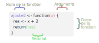

# (PART) Aller plus loin {-}

# Écrire ses propres fonctions

## Introduction et exemples

### Structure d'une fonction

Nous avons vu lors de l'introduction à R que le langage repose sur deux grands concept : les *objets* et les *fonctions*. Pour reprendre une citation de John Chambers, en R, tout ce qui existe est un objet, et tout ce qui se passe est une fonction.

Le principe d'une fonction est de prendre en entrée un ou plusieurs arguments (ou paramètres), d'effectuer un certain nombre d'actions et de renvoyer un résultat :


Nous avons déjà rencontré et utilisé un grand nombre de fonctions, certaines assez simples (`mean`, `max`...) et d'autres beaucoup plus complexes (`ggplot`, `group_by`...). R, comme tout langage de programmation, offre la possibilité de créer et d'utiliser ses propres fonctions.


Voici un exemple de fonction très simple, quoi que d'une utilité douteuse, puisqu'elle se contente d'ajouter 2 à un nombre :

```{r}
ajoute2 <- function(x) {
  res <- x + 2
  return(res)
}
```

En exécutant ce code, on crée une nouvelle fonction nommée `ajoute2`, que l'on peut directement utiliser dans un script ou dans la console :

```{r}
ajoute2(3)
```

Essayons de décomposer pas à pas la structure de cette première fonction.

D'abord, une fonction est créée en utilisant l'instruction `function`. Celle-ci est suivie d'une paire de parenthèses et d'une paire d'accolades.

```{r eval=FALSE}
function() {
  
}
```

Dans les parenthèses, on indique les arguments de la fonction, ceux qui devront être indiqués quand nous l'appellerons. Ici notre fonction ne prend qu'un seul argument, que nous avons décidé de nommer `x` :

```{r eval=FALSE}
function(x) {
  
}
```

Les accolades comprennent une série d'instructions R qui constituent le *corps* de notre fonction. C'est ce code qui sera exécuté quand notre fonction est appelée. On peut utiliser dans le corps de la fonction les arguments qui lui sont passés. Ici, la première ligne utilise la valeur de l'argument `x`, lui ajoute 2 et stocke le résultat dans un nouvel objet `res` :

```{r eval=FALSE}
function(x) {
  res <- x + 2
}
```

Pour qu'elle soit utile, notre fonction doit renvoyer le résultat qu'elle a calculé précédemment. Ceci se fait via l'instruction `return` à qui on passe la valeur à retourner à l'utilisateur :

```{r eval=FALSE}
function(x) {
  res <- x + 2
  return(res)
}
```

Enfin, pour que notre fonction puisse être appelée et utilisée, nous devons lui donner un nom, ou plus précisément la stocker dans un objet :

```{r eval=FALSE}
ajoute2 <- function(x) {
  res <- x + 2
  return(res)
}
```

```{block type='rmdnote'}
Les fonctions étant des objets comme les autres, elles suivent les mêmes contraintes pour leur nom : on a donc droit aux lettres, chiffres, point et tiret bas.

Attention à ne pas donner à votre fonction le nom d'une fonction déjà existante : par exemple, si vous créez une fonction nommée `table`, la fonction du même nom de R base ne sera plus disponible^[Sauf à la préfixer avec `base::table()`.]. Si vous "écrasez" par erreur une fonction existante, il vous suffit de relancer votre session R et de trouver un nouveau nom.
```

Avec le code précédent, on a donc créé un nouvel objet `ajoute2` de type `function`. Cette nouvelle fonction prend un seul argument `x`, calcule la valeur `x + 2` et retourne ce résultat. On l'utilise en tapant son nom suivi de la valeur de ses arguments entre parenthèses, par exemple :

```{r}
ajoute2(41)
```

Ou encore :

```{r}
y <- 5
z <- ajoute2(y)
z
```


À noter que notre fonction marche aussi si on lui passe un vecteur en argument :

```{r}
vec <- 1:5
ajoute2(vec)
```

Si on récapitule, une fonction se définit donc de la manière suivante :




À noter qu'une fonction peut évidemment prendre plusieurs arguments. Dans ce cas on liste les arguments dans les parenthèses en les séparant par des virgules :

```{r}
somme <- function(x, y) {
  return(x + y)
}
```

```{r}
somme(3, 5)
```


### Exemples de fonctions

Prenons un autre exemple : par défaut on sait que la fonction `table` retourne le tri à plat en effectifs d'une variable qualitative. On pourrait dès lors créer notre propre fonction qui renvoie plutôt le tri à plat en pourcentages. Voici une manière de le faire :

```{r}
prop_tab <- function(v) {
  tri <- table(v)
  tri <- tri / sum(tri) * 100
  return(tri)
}
```

Notre fonction prend en entrée un argument nomme `v`, en l'occurrence un vecteur représentant une variable qualitative. On commence par faire le tri à plat de ce vecteur avec `table`, puis on calcule la répartition en pourcentages en divisant ce tri à plat par l'effectif total (`sum(tri)`) et en multipliant par 100.

Testons sur une variable de `hdv2003` :

```{r}
library(questionr)
data(hdv2003)
prop_tab(hdv2003$qualif)
```

Ça fonctionne, mais l'affichage d'un grand nombre de chiffres après la virgule peut nuire à la lisibilité du résultat. On pourrait donc améliorer notre fonction en arrondissant le résultat avec la fonction `round()` avant de le retourner :

```{r}
prop_tab <- function(v) {
  tri <- table(v)
  tri <- tri / sum(tri) * 100
  tri <- round(tri, 2)
  return(tri)
}

prop_tab(hdv2003$qualif)
```

```{block type='rmdnote'}
Quand on modifie une fonction existante, il faut exécuter à nouveau le code correspondant à sa définition pour la "mettre à jour". Ici, si on ne le fait pas l'objet `prop_tab` contiendra toujours l'ancienne définition.

Pour "mettre à jour" une fonction après avoir modifié son code, on peut soit sélectionner le code qui la définit et l'exécuter de la manière habituelle, soit, dans RStudio, se positionner dans le corps de la fonction et utiliser le raccourci clavier `Ctrl + Alt + F`.
```

Ça marche ! Cela dit, limiter à 2 chiffres après la virgule ne convient pas forcément dans tous les cas. L'idéal serait d'offrir la possibilité à l'utilisateur de la fonction de choisir lui-même la précision de l'affichage. Comment ? Tout simplement en ajoutant un deuxième argument à la fonction, que nous nommerons `decimales`, et en utilisant cet argument à la place du 2 dans l'appel à `round()` :

```{r}
prop_tab <- function(v, decimales) {
  tri <- table(v)
  tri <- tri / sum(tri) * 100
  tri <- round(tri, decimales)
  return(tri)
}
```

Désormais, notre fonction s'utilise en lui indiquant deux arguments :

```{r}
prop_tab(hdv2003$qualif, decimales = 1)
```

### Effets de bord

Parfois une fonction n'a pas pour objectif de renvoyer un résultat mais d'accomplir une action, comme générer un graphique. Dans ce cas la fonction peut ne pas inclure d'instruction `return()`. 

```{bloc=rmdnote}
Les actions "visibles" dans notre session R accomplies par une fonction en-dehors du résultat renvoyé sont appelés des *effets de bord*.
```

Par exemple la fonction suivante prend en argument un vecteur et génère un diagramme en barres du tri à plat de cette variable (en modifiant la présentation au passage) :

```{r}
my_barplot <- function(var) {
  tri <- table(var)
  barplot(tri, col = "skyblue", border = NA)
}

my_barplot(hdv2003$clso)
```

Un autre effet de bord très courant consiste à afficher des informations dans la console. Pour cela on peut utiliser `print`, qui affiche de manière aussi lisible que possible l'objet qu'on lui passe en argument :

```{r}
indicateurs <- function(v) {
  print(mean(v))
  print(median(v))
  print(range(v))
}

indicateurs(hdv2003$age)
```

Quand on souhaite seulement afficher une chaîne de caractère, on peut utiliser `cat` qui fournit une sortie plus concise que `print` :

```{r}
hello <- function(nom) {
  cat("Bonjour,", nom, "!")
}

hello("Pierre-Edmond")
```

Enfin, on peut aussi utiliser `message` qui, comme son nom l'indique, affiche un message dans la console avec une mise en forme spécifique. En général on l'utilise plutôt pour afficher des informations relatives au déroulement de la fonction :

```{r}
pause <- function(delai) {
  message("Durée de la pause : ", delai, " secondes.")
  message("Début de la pause...")
  Sys.sleep(delai)
  message("La pause est finie !")
}

pause(2)
```


### Utilité des fonctions

Une question légitime est de se demander dans quels cas il est utile de créer une fonction.

Une règle assez courante consiste à dire que dès qu'on a répété le même code plus de deux fois, il est préférable d'en faire une fonction. Celles-ci ont en effet comme avantage d'éviter la duplication du code.

Imaginons que vous avez récupéré un jeu de données avec toute une série de variables ayant les modalités `"1"` et `"2"` qui correspondent aux réponses `"Oui"` et `"Non"` à des questions.

On crée un *data frame* fictif comportant quatre variables de ce type :

```{r}
df <- data.frame(
  q1 = c("1", "1", "2", "1"),
  q2 = c("1", "2", "2", "2"),
  q3 = c("2", "2", "1", "1"),
  q4 = c("1", "2", "1", "1")
)

df
```

On sait qu'on peut facilement [recoder l'une de ces variables](09-recodages.html#recoder-une-variable-qualitative) à l'aide de la fonction `fct_recode` de l'extension `forcats` :

```{r, eval = FALSE}
df$q1 <- fct_recode(df$q1,
  "Oui" = "1",
  "Non" = "2"
)
```

On peut donc être tenté de dupliquer ce code autant de fois qu'on a de questions à recoder :

```{r, eval = FALSE}
df$q1 <- fct_recode(df$q1,
  "Oui" = "1",
  "Non" = "2"
)
df$q2 <- fct_recode(df$q2,
  "Oui" = "1",
  "Non" = "2"
)
df$q3 <- fct_recode(df$q3,
  "Oui" = "1",
  "Non" = "2"
)
df$q4 <- fct_recode(df$q4,
  "Oui" = "1",
  "Non" = "2"
)
```

Il est toutefois plus judicieux de créer une fonction spécifique pour ce recodage :

```{r}
recode_oui_non <- function(var) {
  new_var <- fct_recode(var,
    "Oui" = "1",
    "Non" = "2"
  )
  return(new_var)
}
```

Il est alors très simple d'appliquer ce recodage à plusieurs variables :

```{r, eval = FALSE}
df$q1 <- recode_oui_non(df$q1)
df$q2 <- recode_oui_non(df$q2)
df$q3 <- recode_oui_non(df$q3)
df$q4 <- recode_oui_non(df$q4)
```

Autre avantage, si nous réalisons que nous avons commis une erreur et qu'en fait le code `"1"` correspondait à `"Non"` et le code `"2"` à `"Oui"`, on n'a pas besoin de modifier tous les endroits où l'on a copié/collé notre recodage, mais seulement la définition de la fonction.

Les avantages de procéder ainsi sont donc multiples :

- créer une fonction évite la répétition du code et le rend moins long et plus lisible, surtout si on donne à notre fonction un nom explicite permettant de comprendre immédiatement ce qu'elle fait.
- créer une fonction évite les erreurs de copier/coller du code.
- une fonction permet de mettre à jour plus facilement son code : si on se rend compte d'une erreur ou si on souhaite améliorer son fonctionnement, on n'a qu'un seul endroit à modifier.
- enfin, créer des fonctions permet potentiellement de rendre son code réutilisable d'un script à l'autre ou même d'un projet à l'autre. Voire, à terme, de les regrouper dans un *package* pour soi-même ou pour diffusion à d'autres utilisateurs de R.

 
## Arguments et résultat d'une fonction

### Définition des arguments

Les arguments (ou paramètres) d'une fonction sont ce qu'on lui donne "en entrée", et qui vont soit lui fournir des données, soit modifier son comportement. La liste des arguments acceptés par une fonction est indiquée entre parenthèses de l'appel de `function` :

```{r, eval = FALSE}
ma_fonction <- function(arg1, arg2, arg3) {
  ...
}
```


```{block=rmdnote}
Une fonction peut aussi ne pas accepter d'arguments, dans ce cas on la définit juste avec `function()`.
```

Lors de l'appel de la fonction, on peut lui passer les arguments *par position* :

```{r, eval = FALSE}
ma_fonction(x, 12, TRUE)
```

Dans ce cas, `arg1` vaudra `x`, `arg2` vaudra `12` et `arg3` vaudra `TRUE`.

On peut aussi passer les arguments *par nom* :

```{r, eval = FALSE}
ma_fonction(arg1 = x, arg2 = 12, arg3 = TRUE)
```

Quand on passe les arguments par nom, on peut les indiquer dans l'ordre que l'on souhaite :

```{r, eval = FALSE}
ma_fonction(arg1 = x, arg3 = TRUE, arg2 = 12)
```

Et on peut évidemment mélanger passage par position et passage par nom :

```{r, eval = FALSE}
ma_fonction(x, 12, arg3 = TRUE)
```

Le plus souvent, les premiers arguments acceptés par une fonction sont les données sur lesquelles elle va travailler, tandis que les arguments suivants sont des paramètres qui vont modifier son comportement. Par exemple, `median` accepte comme premier argument `x`, un vecteur, puis un argument `na.rm` qui va changer sa manière de calculer la médiane des valeurs de `x`.

En général on appelle la fonction en passant les paramètres correspondant aux données par position, et les autres en les nommant. C'est ainsi qu'on ne fait ni `median(x = tailles, na.rm = TRUE)` ni `median(tailles, TRUE)`, mais plutôt `median(tailles, na.rm = TRUE)`.

En ce qui concerne le nom des arguments eux-mêmes, en général ceux correspondant aux données transmises à une fonction peuvent avoir des noms relativement génériques (`x`, `y`, `v` pour un vecteur, `data` ou `df` pour un data.frame...). Les autres doivent par contre avoir des noms à la fois courts et explicites : par exemple plutôt `decimales` que `nd` ou `nombre_de_decimales`. 


### Valeurs par défaut

Au moment de la définition de la fonction, on peut indiquer une valeur par défaut qui sera prise par l'argument si l'utilisateur de la fonction n'en fournit pas. 

Si on reprend la fonction `prop_tab` déjà définie plus haut :

```{r, eval = FALSE}
prop_tab <- function(v, decimales) {
  tri <- table(v)
  tri <- tri / sum(tri) * 100
  tri <- round(tri, decimales)
  return(tri)
}
```

On peut indiquer une valeur par défaut de l'argument `decimales` (qui indique le nombre de chiffres à conserver après la virgule) de la manière suivante :

```{r}
prop_tab <- function(v, decimales = 1) {
  tri <- table(v)
  tri <- tri / sum(tri) * 100
  tri <- round(tri, decimales)
  return(tri)
}
```

Si on appelle `prop_tab` en lui passant uniquement le vecteur `v`, on voit que `decimales` vaut bien 1 :

```{r}
prop_tab(hdv2003$qualif)
```


### L'argument `...`

Une fonction peut prendre un argument spécial, nommé `...` :

```{r}
ma_fonction <- function(x, correct = TRUE, ...) {
  
}
```

Cet argument spécial "capture" tous les arguments présents et qui n'ont pas été définis avec la fonction. Par exemple, si on appelle la fonction précédente avec :

```{r}
ma_fonction(1:5, correct = FALSE, title = "Titre", size = 12)
```

Alors `...` contiendra les arguments `title` et `size` et leurs valeurs.

En général `...` est utilisé pour passer ces arguments à d'autres fonctions. Reprenons notre fonction `my_barplot` définie précédemment :

```{r}
my_barplot <- function(var) {
  tri <- table(var)
  barplot(tri, col = "skyblue", border = NA)
}
```

On pourrait permettre à l'utilisateur de personnaliser les couleurs des barres et de leurs bordures en ajoutant des arguments supplémentaires :

```{r}
my_barplot <- function(var, col = "skyblue", border = NA) {
  tri <- table(var)
  barplot(tri, col = col, border = border)
}
```

Mais si on veut aussi permettre de personnaliser d'autres arguments de `barplot` comme `main`, `xlab`, `xlim`, etc., il faudrait rajouter autant d'arguments supplémentaires à notre fonction, ce qui deviendrait vite ingérable. Une solution est de "capturer" tous les arguments supplémentaires avec `...` et de les passer directement à `barplot`, de cette manière : 

```{r}
my_barplot <- function(var, ...) {
  tri <- table(var)
  tri <- sort(tri)
  barplot(tri, ...)
}
```

Ce qui permet d'appeler notre fonction avec tous les arguments possibles de `barplot`, par exemple :


```{r}
my_barplot(hdv2003$clso, col = "yellowgreen", main = "Croyez-vous en l'existence des classes sociales ?")
```


### Résultat d'une fonction

On l'a vu, l'objectif d'une fonction est en général de renvoyer un résultat. Lors de la définition d'une fonction, le résultat peut être retourné en utilisant la fonction `return` :

```{r}
ajoute2 <- function(x) {
  res <- x + 2
  return(res)
}
```

En réalité, l'utilisation de `return` n'est pas obligatoire : une fonction retourne automatiquement le résultat de la dernière instruction qu'elle exécute. On aurait donc pu écrire :

```{r}
ajoute2 <- function(x) {
  res <- x + 2
  res
}
```

Ou même, encore mieux et plus lisible :

```{r}
ajoute2 <- function(x) {
  x + 2
}
```

À noter que lorsque R rencontre une instruction `return` dans une fonction, il interrompt immédiatement son exécution et "sort" de la fonction en renvoyant le résultat.

Ainsi, dans la fonction suivante :

```{r}
ajoute2 <- function(x) {
  return(x + 2)
  x * 5
}
```

L'instruction `x * 5` ne sera jamais exécutée car R "sort" de la fonction dès qu'il tombe sur le `return` de la ligne précédente.

Corrolaire de ce comportement, on ne peut utiliser plusieurs `return` pour renvoyer plusieurs résultats depuis une seule fonction. Est-ce à dire qu'une fonction R ne pourrait renvoyer qu'une seule valeur ? Non, car si elle ne peut retourner qu'un seul objet, celui-ci peut être complexe et comporter plusieurs valeurs.

Par exemple, on pourrait créer une fonction `summary` "personnalisée" qui ne retournerait que la moyenne et l'écart-type d'un vecteur numérique. Pour cela, on pourrait renvoyer un vecteur comportant ces deux valeurs :

```{r}
resume <- function(x) {
  moyenne <- mean(x)
  ecart_type <- sd(x)
  c(moyenne, ecart_type)
}
```

```{r}
resume(hdv2003$age)
```

Mais dans ce cas de figure il est recommandé de retourner plutôt une liste nommée^[Les listes seront abordées un peu plus en détail dans la partie \@ref(listes)], de cette manière :

```{r}
resume <- function(x) {
  moyenne <- mean(x)
  ecart_type <- sd(x)
  list(moy = moyenne, et = ecart_type)
}
```

```{r}
resume(hdv2003$age)
```

On a du coup un affichage un peu plus lisible, et surtout on peut accéder aux valeurs renvoyées via leur nom :

```{r}
res <- resume(hdv2003$age)
res$moy
```


## Portée des variables

Un point délicat mais important quand on commence à créer ses propres fonctions concerne la *portée des variables*, c'est-à-dire la façon dont les objets créés dans une fonction et en-dehors "cohabitent". C'est une question assez complexe, mais seules quelques grandes règles sont réellement utiles au départ.

### Une fonction peut accéder à un objet extérieur

Si on fait appel dans une fonction à un objet qui n'existe pas et n'a pas été passé comme argument, on obtient évidemment une erreur :

```{r, error = TRUE}
f <- function(x) {
  x + ajout
}

f(2)
```

On peut évidemment créer cet objet dans notre fonction avant de l'utiliser :

```{r}
f <- function(x) {
  ajout <- 2
  x + ajout
}

f(2)
```

Mais on peut aussi accéder depuis une fonction à un objet qui existe dans notre environnement au moment où la fonction a été appelée :

```{r}
f <- function(x) {
  x + ajout
}

ajout <- 3
f(2)
```

Dans cet exemple, au moment de l'exécution de `f`, comme `ajout` n'existe pas au sein de la fonction (il n'a pas été passé comme argument ni défini dans le corps de la fonction), R va chercher dans l'environnement global, celui depuis lequel la fonction a été appelée. Comme il trouve un objet `ajout`, il utilise sa valeur au moment de l'appel de la fonction.

Que se passe-t-il si un objet avec le même nom existe à la fois dans la fonction et dans notre environnement ? Dans ce cas R privilégie l'objet créé dans la fonction :

```{r}
f <- function(x) {
  ajout <- 10
  x + ajout
}

ajout <- 3
f(2)
```

Cette règle s'applique également pour les arguments passés à la fonction :

```{r}
f <- function(x, ajout) {
  x + ajout
}

ajout <- 3
f(2, 20)
```


À l'inverse, un objet créé à l'intérieur d'une fonction n'est pas accessible à l'extérieur de celle-ci :

```{r, error = TRUE}
f <- function(x) {
  produit <- 8
  x * produit
}

produit
```

```{block type='rmdimportant'}
Les objets créés dans notre session et qui existent dans notre environnement (tel que visible dans l'onglet *Environment* de RStudio) sont appelés des variables "globales" : elles existent et sont accessibles pour les fonctions appelées depuis cet environnement. Les objets créés lors de la définition d'une fonction sont à l'inverse des variables "locales" : elles n'existent qu'à l'intérieur de la fonction et pour la durée de son exécution. Si deux objets du même nom existent, les objets locaux sont prioritaires par rapport aux objets globaux.
```

Une conséquence de cette règle est qu'il n'est pas possible de modifier un objet de notre environnement global depuis une fonction^[En fait c'est possible avec l'opérateur `<<-`, mais c'est fortement déconseillé dans la très grande majorité des cas.] :

```{r}

f <- function() {
  ajout <- 10
  ajout
}

ajout <- 3
f()
ajout

```

Ici on voit que même si pendant l'exécution de la fonction `ajout` vaut bien 10 (puisque c'est la valeur qu'elle retourne), dès qu'on n'est plus dans la fonction `ajout` vaut toujours sa valeur de départ, c'est-à-dire 3. Dans ce cas, au moment de l'instruction `ajout <- 10` de notre fonction, R crée un objet local qui vaut bien 10, mais qui est distinct de l'objet global dont la valeur est 3. Cet objet local n'existe que le temps de l'exécution de la fonction.

Si on souhaite modifier un objet, on doit donc le passer comme argument en entrée de notre fonction, et le renvoyer comme résultat en sortie :

```{r}
df <- data.frame(x = 1:3)

recode_df <- function(df) {
  df$x <- df$x * 10
  df
}

df <- recode_df(df)
df
```

## Les fonctions comme objets

Quand on crée une fonction, on la "nomme" en la stockant dans un objet. Cet objet peut être utilisé comme n'importe quel autre objet dans R. On peut ainsi copier une fonction en l'attribuant à un nouvel objet :

```{r}
f <- function(x) {
  x + 2
}

g <- f
g(10)
```

On a déjà vu à de nombreuses reprises que quand on fournit juste un nom d'objet à R, celui-ci affiche son contenu dans la console. C'est aussi le cas pour les fonctions : dans ce cas c'est le code source de la fonction qui est affiché.

```{r}
f
```

### Passer des fonctions comme argument

Certaines fonctions sont prévues pour s'appliquer elles-mêmes à des fonctions, par exemple `formals` et `body` permettent d'afficher spécifiquement les arguments et le corps d'une fonction passée en argument : 

```{r}
formals(f)
```

```{r}
body(f)
```

Il est donc possible de passer une fonction comme argument d'une autre fonction, comme dans `body(f)`. On a déjà vu un exemple de ce type de fonctionnement avec la fonction `tapply` dans la partie \@ref(tapply)]. Celle-ci prend trois arguments : un vecteur de valeurs, un facteur, et une fonction. Elle applique ensuite la fonction aux valeurs pour chaque niveau du facteur.

Par exemple, si on a un data frame avec une liste de fruits et leur poids :

```{r}
df <- data.frame(
  fruit = c("Pomme", "Pomme", "Citron", "Citron"),
  poids = c(147, 189, 76, 91)
)

df
```

On peut utiliser `tapply` pour calculer le poids moyen par type de fruit :

```{r}
tapply(df$poids, df$fruit, mean)
```

Si on souhaite plutôt calculer le poids maximal, il suffit de passer à `tapply` la fonction `max` plutôt que la fonction `mean` :

```{r}
tapply(df$poids, df$fruit, max)
```

### Fonctions anonymes

Dans le cas où on souhaite calculer quelque chose pour lequel une fonction n'existe pas déjà, on peut créer une nouvelle fonction et la passer en argument :

```{r}
poids_moyen_kg <- function(poids) {
  mean(poids / 1000)
}

tapply(df$poids, df$fruit, poids_moyen_kg)
```

Si on ne souhaite pas réutiliser cette fonction par la suite, on peut aussi définir cette fonction directement comme argument de `tapply` :

```{r}
tapply(df$poids, df$fruit, function(poids) {
  mean(poids/1000)
})
```

Dans ce cas on a créé ce qu'on appelle une *fonction anonyme*, qui n'a pas de nom (elle n'a pas été stockée dans un objet) et qui n'existe que le temps de l'appel à `tapply`.


## Ressources

L'ouvrage *R for Data Science*, accessible en ligne, contient [un chapitre complet](http://r4ds.had.co.nz/functions.html) d'introduction sur les fonctions (en anglais).

L'ouvrage *Advanced R* (également en anglais) aborde de manière très approfondie [les fonctions](https://adv-r.hadley.nz/functions.html) ainsi que la [programmation fonctionnelle](https://adv-r.hadley.nz/fp.html).

Le manuel officiel *Intorduction to R* (toujours en anglais) contient une partie sur [l'écriture de ses propres fonctions](https://cran.r-project.org/doc/manuals/R-intro.html#Writing-your-own-functions).


## Exercices

### Introduction et exemples


**Exercice 1.1**

Écrire une fonction nommée `perimetre` qui prend en entrée un argument nommé `r` et retourne le périmètre d'un cercle de rayon `r`, c'est-à-dire `2 * pi * r` (`pi` est un objet R qui contient la valeur de $\pi$). Vérifier avec l'appel suivant :

```{r echo=FALSE, eval=FALSE}
perimetre <- function(r) {
  2 * pi * r
}
```

```{r}
perimetre(4)
```

\iffalse
<div class="solution-exo">
```{r eval=FALSE}
perimetre <- function(r) {
  resultat <- 2 * pi * r
  return(resultat)
}
```
</div>
\fi


**Exercice 1.2**

Écrire une fonction `etendue` qui prend en entrée un vecteur numérique et retourne la différence entre la valeur maximale et la valeur minimale de ce vecteur.

```{r echo=FALSE}
etendue <- function(v) {
  vmax <- max(v)
  vmin <- min(v)
  return(vmax - vmin)
}
```

```{r}
etendue(c(18, 35, 21, 40))
```

\iffalse
<div class="solution-exo">
```{r eval=FALSE}
etendue <- function(v) {
  vmax <- max(v)
  vmin <- min(v)
  return(vmax - vmin)
}
```
</div>
\if


**Exercice 1.3**

Écrire une fonction nommée `alea` qui tire un nombre au hasard entre 0 et 100. Cette fonction ne prend pas d'argument et son corps est constitué des étapes suivantes :

- tirer un nombre aléatoire entre 0 et 1 avec `runif(1)`
- multiplier ce nombre par 100
- l'arrondir à l'entier le plus proche avec `round`
- retourner le résultat

\iffalse
<div class="solution-exo">
```{r eval=FALSE}
alea <- function() {
  nombre <- runif(1)
  nombre <- nombre * 100
  nombre <- round(nombre)
  return(nombre)
}
```
</div>
\if


Modifier cette fonction pour qu'elle accepte un argument `max` et qu'elle génère un nombre entier au hasard entre 0 et `max`.

\iffalse
<div class="solution-exo">
```{r eval=FALSE}
alea <- function(max) {
  nombre <- runif(1)
  nombre <- nombre * max
  nombre <- round(nombre)
  return(nombre)
}
```
</div>
\if

**Facultatif :** Modifier à nouveau la fonction pour qu'elle accepte deux arguments `min` et `max` et qu'elle génère un nombre entier au hasard compris entre `min` et `max`.

\iffalse
<div class="solution-exo">
```{r eval=FALSE}
alea <- function(min, max) {
  nombre <- runif(1)
  nombre <- nombre * (max - min) + min
  nombre <- round(nombre)
  return(nombre)
}
```
</div>
\if


**Exercice 1.4**

Écrire une fonction nommée `meteo` qui prend un argument nommé `ville` avec le corps suivant :

```{r eval=FALSE}
out <- readLines(paste0("https://v2.wttr.in/", ville))
cat(out, sep = "\n")
```

Tester la fonction avec par exemple `meteo("Lyon")`.

\iffalse
<div class="solution-exo">
```{r eval=FALSE}
meteo <- function(ville) {
  out <- readLines(paste0("https://v2.wttr.in/", ville))
  cat(out, sep = "\n")
}
```
</div>
\if


**Exercice 1.5**

Soit le code suivant, qui recode plusieurs variables du jeu de données `hdv2003` :

```{r}
library(questionr)
library(forcats)
data(hdv2003)
d <- hdv2003

d$hard.rock <- fct_recode(d$hard.rock, "o" = "Oui", "n" = "Non")
d$hard.rock <- fct_explicit_na(d$hard.rock, "Manquant")
d$lecture.bd <- fct_recode(d$lecture.bd, "o" = "Oui", "n" = "Non")
d$lecture.bd <- fct_explicit_na(d$lecture.bd, "Manquant")
```

Utiliser ce code de reodage pour créer une nouvelle fonction `recode_oui_non`, et appliquer cette fonction à `hard.rock`, `lecture.bd` et `couture`.


\iffalse
<div class="solution-exo">

```{r eval=FALSE}
recode_oui_non <- function(f) {
  res <- fct_recode(f, "o" = "Oui", "n" = "Non")
  res <- fct_explicit_na(res, "Manquant")
  return(res)
}

d <- hdv2003
d$hard.rock <- recode_oui_non(d$hard.rock)
d$lecture.bd <- recode_oui_non(d$lecture.bd)
d$cuisine <- recode_oui_non(d$cuisine)
```
</div>
\if


## Arguments et résultats

**Exercice 2.1**

Soit la fonction suivante :

```{r echo=FALSE, eval=FALSE}

```

\iffalse
<div class="solution-exo">
```{r eval=FALSE}

```
</div>
\fi


TODO

différence funct vs funct() pour les fonctions sans argument

## Portée des variables

## Les fonctions comme objets