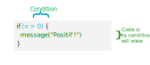
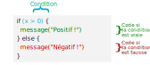
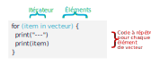
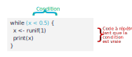

# Programmer avec R

Nous avons vu dans la partie précédente comment écrire nos propres fonctions. Pour pouvoir aller plus loin nous allons rappeler ou aborder ici de nouveaux types de données et éléments du langage qui permettent de programmer des actions un peu plus complexes.

Les notions décrites dans cette partie s'appliquent pour le développement de fonctions, mais peuvent aussi être mises en oeuvre à tout moment dans un script.

On commence par charger les jeux de données d'exemple utilisés par la suite :

```{r}
library(questionr)
data(hdv2003)
data(rp2012)
```


## Structures de données

R propose de nombreuses structures de données différentes, et les extensions peuvent en implémenter de nouvelles. Cette section présente trois structures parmi les plus utilisées : les vecteurs atomiques, les listes et les tableaux de données.

### Vecteurs atomiques

Les vecteurs atomiques sont des structures qui regroupent plusieurs éléments, avec une contrainte : les éléments doivent tous être du même type, et ils ne peuvent pas contenir d'objets complexes. Les vecteurs atomiques ont déjà été présentés section \@ref(vecteurs).

#### Création d'un vecteur

On peut construire un vecteur avec la fonction `c()`.

```{r}
x <- c(1, 3, 8)
```

Si on souhaite générer un vecteur de valeurs entières successives, on peut également utiliser l'opérateur `:` ou la fonction `seq_len()`.

```{r}
2:8
```

```{r}
seq_len(5)
```

La fonction `seq()` permet de générer des séquences régulière plus complexes.

```{r}
seq(0.5, 2.5, by = 0.5)
```

```{r}
seq(0, 4, length.out = 6)
```

Enfin, la fonction `rep()` permet de répéter un élément ou un vecteur.

```{r}
rep("Pomme", 6)
```

```{r}
rep(1:4, 2)
```

Il peut parfois être utile de créer des vecteurs "vides". Dans ce cas on peut les initialiser avec les fonctions `vector()`, `character()` ou `numeric()`. Par défaut ces fonctions renvoient un vecteur vide, sans éléments, mais on peut aussi leur indiquer en argument le nombre d'éléments souhaités.

```{r}
numeric()
character(2)
```


#### Vecteurs nommés

Les éléments d'un vecteur peuvent être nommés. Ceci peut se faire au moment de la création du vecteur.

```{r}
x <- c(e1 = 1, e2 = 3, e3 = 8)
x
```

On peut utiliser `names()` pour récupérer les noms des éléments d'un vecteur.

```{r}
names(x)
```

On peut aussi utiliser `names()` pour créer ou modifier les noms d'un vecteur existant.

```{r}
names(x) <- c("foo", "bar", "baz")
x
```


#### Types de vecteurs

On peut déterminer le type d'un vecteur avec l'instruction `typeof`.

```{r}
x <- c(1, 3, 8)
typeof(x)
y <- c("foo", "bar", "baz")
typeof(y)
z <- c(TRUE, FALSE, FALSE)
typeof(z)
```

Parmi les principaux types de données on notera^[Il en existe d'autres, comme `complex` ou `raw`, mais qui sont moins fréquemment utilisés.] :

- les chaîne de caractères (`character`)
- les nombres flottants (`double`)
- les nombres entiers (`integer`)
- les booléens, ou valeurs logiques (`logical`)

À noter que par défaut les nombres sont considérés comme des nombres flottants (des nombres décimaux avec une virgule) : pour les définir explicitement comme nombres entiers on peut leur ajouter le suffixe `L`.

```{r}
x <- c(1L, 3L, 8L)
typeof(x)
```

On peut tester le type d'un vecteur avec les fonctions `is.character`, `is.double`, `is.logical`... Il existe aussi la fonction `is.numeric` qui teste si un vecteur est de type `double` ou `integer`.

```{r}
is.character("Chihuahua")
```

```{r}
is.logical(3 == 2)
```

```{r}
is.numeric(1:5)
```

Petite spécificité, les facteurs (voir section \@ref(facteurs)) ne sont pas considérés par R comme des `character`, même s'ils comportent des chaînes de caractères. Pour tester si un vecteur est de type facteur, on peut utiliser `is.factor()`. 

```{r}
fac <- factor(c("rouge", "vert", "rouge"))
```

```{r}
is.character(fac)
```

```{r}
is.factor(fac)
```

Tous les éléments d'un vecteur doivent être du même type. Si ça n'est pas le cas, les éléments seront convertis au type le plus "général", sachant que les `character` sont plus généraux que les `numeric`, qui sont eux-mêmes plus généraux que les `logical`.

```{r}
c(1, "foo")
c(TRUE, 2)
c(FALSE, "bar")
```

La valeur `NA`, comme on l'a vu, permet d'indiquer une valeur manquante (`Not Available`). Il existe en réalité plusieurs types de `NA`, même si cette distinction est la plupart du temps transparente pour l'utilisateur. On a ainsi notamment des valeur `NA_integer_`, `NA_character_`, `NA_real_`.

```{r}
c(1, 2, NA_character_)
```


#### Sélection d'éléments

On a vu section \@ref(vecteurs) que l'opérateur `[]` peut être utilisé pour sélectionner ou modifier des éléments d'un vecteur. Cet opérateur peut comporter :

- des nombres (qui sélectionnent par position)
- des chaînes de caractères (qui sélectionnent par nom)
- une condition ou des booléens (qui sélectionnent les éléments correspondant à `TRUE`)

```{r}
x <- c(e1 = 1, e2 = 2, e3 = 8, e4 = 12)
x[c(1, 4)]
x[c("e2", "e4")]
x[x < 10]
```

Si on fournit à `[]` un ou plusieurs nombres négatifs, les valeurs correspondantes seront supprimées plutôt que sélectionnées.

```{r}
x[-1]
```

```{r}
x[c(-2, -4)]
```

Si on souhaite afficher les premières ou dernières valeurs d'un vecteur, les fonctions `head()` et `tail()` peuvent être utiles.

```{r}
head(x, 2)
```
```{r}
tail(x, 1)
```

#### Modification

Utilisé conjointement avec l'opérateur d'assignation `<-`, l'opérateur `[]` permet aussi de remplacer certains éléments.

```{r}
x[1] <- -1000
x[x > 10] <- NA
x
```

Utilisé sans arguments, `[]` se contente de renvoyer le vecteur. Mais couplé à une assignation, il remplace chacun des éléments du vecteur plutôt que le vecteur lui-même.

```{r}
x[] <- 3
x
```

### Listes

Les listes sont une généralisation des vecteurs : elles regroupent également plusieurs éléments, mais ceux-ci peuvent être de n'importe quel type, y compris des objets complexes. Une liste peut donc contenir elle-même des vecteurs, des listes, des tableaux de données, des fonctions, des graphiques `ggplot2` stockés dans un objet, etc.

#### Création

On construit une liste avec la fonction `list`.

```{r}
l <- list(1, "foo", c("Pomme", "Citron"))
l
```

La manière dont R affiche le contenu d'une liste dans la console diffère de celle des vecteurs. Dans le cas d'une liste ses éléments sont affichés les uns en dessous des autres, et séparés par leur indice numérique entre une paire de crochets.

Comme pour les vecteurs, on peut nommer les éléments à la création de la liste ou avec la fonction `names()`.

```{r}
l <- list(nombre = 1, char = "foo", vecteur = c("Pomme", "Citron"))
l
```

Dans ce cas l'affichage de la liste dans la console montre ces noms plutôt que les indices numériques.

Si les noms comportent des caractères spéciaux comme des espaces, il faut les entourer de quotes inverses.

```{r}
l <- list(`Élément 1` = 1, `Élément 2` = "foo")
l
```

L'affichage des listes peut vite devenir illisible quand la liste est plus complexe^[Pour rappel, la fonction `runif()` renvoit des nombres aléatoires suivant une loi uniforme, par défaut compris entre 0 et 1.].

```{r}
l <- list(
    l2 = list(x = 1:10, y = c("Pomme", "Citron")),
    df = data.frame(v1 = 2:5, v2 = LETTERS[2:5]),
    y = runif(20)
)
l
```

Dans ce cas la fonction `str` peut être utile pour afficher de manière plus compacte la structure de la liste.

```{r}
str(l)
```

#### Ajout d'éléments

Attention, si on souhaite ajouter un nouvel élément à une liste, il ne faut pas utiliser à nouveau `list()`, car dans ce cas notre liste de départ est vue comme une "sous-liste".

```{r}
l <- list(e1 = 1:3, e2 = "Chihuhua")
l2 <- list(l, nouveau = 100)
str(l2)
```

Il faut à la place utiliser `c()`, comme pour les vecteurs.

```{r}
l3 <- c(l, nouveau = 100)
str(l3)
```

`c()` permet aussi de "concaténer" deux listes existantes en une seule.

```{r}
l1 <- list(a = 1, b = 2)
l2 <- list(x = 3, y = 4)
c(l1, l2)
```

On peut aussi utiliser la fonction `append()` qui permet d'ajouter de nouveaux éléments à la fin de la liste ou de les insérer à une position spécifique indiquée par l'argument `after`.

```{r}
append(l, list(nouveau1 = 100, nouveau2 = 102), after = 1)
```


#### Sélection d'éléments

Il y a deux opérateurs différents qui permettent de sélectionner ou modifier les éléments d'une liste : les crochets simples `[]` et les crochets doubles `[[]]`. La différence entre les deux opérateurs est souvent source de confusion.

Partons de la liste suivante :

```{r}
l <- list(1:5, "foo", c("Pomme", "Citron"))
l
```

Si on utilise les crochets simples pour sélectionner le premier élément de cette liste, on obtient le résultat suivant :

```{r}
l[1]
```

On notera que le résultat est une liste à un seul élément.

Si on utilise les crochets doubles :

```{r}
l[[1]]
```

On obtient cette fois-ci non pas une liste à un seul élément, mais uniquement le premier élément de la liste de départ "tel quel".

```{block, type='rmdimportant'}
La différence est importante, mais pas toujours facile à retenir. On peut éventuellement utiliser deux petites astuces mnémotechniques :

- si une liste est un train composé de plusieurs wagons, `[1]` retourne le premier wagon du train, tandis que `[[1]]` renvoie le contenu du premier wagon.
- une alternative est de considérer que `[[]]` va chercher "plus profondément" que `[]`.
```

Un autre point important est que si on passe plusieurs éléments à `[[]]`, la sélection se fait d'une manière récursive peu intuitive et source d'erreurs. Il est donc conseillé de **toujours utiliser `[[]]` avec un seul argument**, et d'utiliser `[]` si on souhaite sélectionner plusieurs éléments d'une liste.

```{r}
l[c(1, 2)]
```

```{block, type='rmdimportant'}
En résumé :

- si on souhaite récupérer uniquement le contenu d'un élément d'une liste, on utilise `[[]]` avec un seul argument.
- si on souhaite récupérer une nouvelle liste en sélectionnant des éléments de notre liste actuelle, on utilise `[]` avec un ou plusieurs arguments.
```

```{block, type='rmdnote'}
Comme pour les vecteurs, on peut aussi utiliser des nombres négatifs pour exclure des éléments plutôt que les sélectionner, ainsi que les fonctions `head()` et `tail()`.
```

Si la liste est nommée, on peut sélectionner des éléments par noms avec les deux opérateurs.

```{r}
l <- list(nombre = 1, char = "foo", vecteur = c("Pomme", "Citron"))
l[c("nombre", "char")]
```

```{r}
l[["vecteur"]]
```

On peut aussi utiliser l'opérateur `$`, qui équivaut à `[[]]` :

```{r}
l$vecteur
```

Là aussi, si le nom comporte des espaces, on doit l'entourer avec des quotes inverses.

```{r}
l <- list(`Élément 1` = 1, `Élément 2` = "foo")
l$`Élément 1`
```

Attention, `$` effectue ce qu'on appelle du *"partial matching"*, c'est-à-dire qu'il peut récupérer un élément même si on lui a passé seulement le début du nom.

```{r}
l <- list(nombre = 1, char = "foo")
l$no
```

#### Modification

Comme pour les vecteurs, on peut utiliser les opérateurs de sélection pour modifier des éléments. Si on n'en modifie qu'un seul, `[]` et `[[]]` sont équivalents.

```{r}
l <- list(nombre = 1:5, char = "foo", vecteur = c("Pomme", "Citron"))
l[1] <- "first"
l[[2]] <- "second"
l
```

Comme pour la sélection, si on souhaite modifier plusieurs éléments, on doit utiliser les crochets simples.

```{r}
l <- list(nombre = 1:5, char = "foo", vecteur = c("Pomme", "Citron"))
l[c(1, 3)] <- 0
l
```

```{block type='rmdimportant'}
Comme pour la sélection, attention à ne pas utiliser les crochets doubles pour modifier plusieurs éléments d'une liste. Ceux-ci ne génèreront pas forcément d'erreur mais n'auront pas le comportement attendu.
```

Enfin, si on souhaite supprimer un ou plusieurs éléments d'une liste, il faut leur attribuer la valeur `NULL`^[Si on veut ajouter un élément `NULL` à une liste, il faut utiliser les crochets simples avec la syntaxe `l["foo"] <- list(NULL)`.].

```{r}
l <- list(nombre = 1:5, char = "foo", vecteur = c("Pomme", "Citron"))
l$char <- NULL
l
```


#### Utilisation

En tant que généralisation des vecteurs atomiques, les listes sont utiles dès qu'on souhaite regrouper des éléments complexes ou hétérogènes.

On les utilisera par exemple pour retourner plusieurs résultats différents depuis une fonction.

```{r}
indicateurs <- function(x) {
    list(moyenne = mean(x), variance = var(x))
}

x <- 1:10
res <- indicateurs(x)
res$moyenne
```

On utilise également les listes pour stocker une série d'objets complexes et leur appliquer des fonctions, comme on le verra dans la section \@ref(purrr).

Pour donner un aperçu, l'exemple fictif suivant récupère les noms de tous les fichiers CSV du répertoire courant et les importent tous dans une liste à l'aide de `purrr::map()` et de `read_csv()`. 

```{r eval=FALSE}
files <- list.files(pattern = "*.csv")
dfs <- purrr::map(files, read_csv)
```

On pourra ensuite utiliser cette liste de tableaux pour leur appliquer des transformations ou les fusionner.


### *data frame* et *tibble*

On a déjà utilisé les tableaux de données à de nombreux reprises en manipulant des *data frames* ou des *tibbles*. Les seconds sont une variante des premiers, les différences entre les deux ayant été abordées section \@ref(tibbles). 

Un tableau de données est en fait une liste nommée de vecteurs avec une contrainte spécifique : ces vecteurs doivent tous être de même longueur, ce qui garantit le format "tabulaire" des données.

#### Création

Un tableau de données est le plus souvent créé en important des données depuis un fichier au format CSV, tableur ou autre. On peut cependant créer un *data frame* manuellement via la fonction `data.frame()` :

```{r}
df <- data.frame(
    fruit = c("Pomme", "Pomme", "Citron"),
    poids = c(154, 167, 92),
    couleur = c("vert", "vert", "jaune")
)
```

On peut aussi créer un *tibble* manuellement avec la fonction `tibble()`. La syntaxe est la même que celle de `data.frame()`, mais avec un comportement un peu différent : notamment, les noms comportant des espaces ou des caractères spéciaux sont conservés tels quels.

La fonction `tribble()` permet de créer un tableau manuellement avec une syntaxe "par ligne" qui peut être un peu plus naturelle.

```{r}
df_tib <- tribble(
    ~fruit,   ~poids, ~couleur,
    "Pomme",  154,    "vert",
    "Pomme",  167,    "vert",
    "Citron", 92,     "jaune"
)
```

Enfin, on peut convertir un *data frame* en *tibble* avec la fonction `as_tibble()`.

#### Noms de colonnes et de lignes

On peut accéder et modifier les noms des colonnes d'un tableau avec les fonctions `names()` ou `colnames()` (qui sont équivalentes).

```{r}
names(df)
colnames(df)
```

On peut attribuer des noms aux lignes d'un *data frame* à l'aide de la fonction `rownames()`. Attention cependant, les noms de ligne ne sont (volontairement) pas pris en charge par les *tibbles*.

```{r}
rownames(df) <- c("fruit1", "fruit2", "fruit3")
rownames(df)
rownames(as_tibble(df))
```

Si on souhaite conserver d'éventuels noms de ligne en passant d'un *data frame* à un *tibble*, il faut créer une nouvelle variable spécifique, soit manuellement soit avec la fonction `rownames_to_column()` (qui a l'avantage de placer la nouvelle colonne en première position du tableau).

```{r}
rownames_to_column(df, "name")
```

#### Sélection 

On a déjà vu dans les parties précédentes plusieurs manières de sélectionner des éléments dans un tableau de données. 

Ainsi, on peut sélectionner une colonne via l'opérateur `$`.

```{r}
df$fruit
```

Attention, si votre tableau de données est un *data frame*, R fera du *partial matching* sur le nom donné à `$`, ce qui n'est pas toujours un comportement souhaitable (les *tibbles* n'ont pas ce comportement).

```{r}
df$poi
```
```{r results="hide"}
as_tibble(df)$poi
```

Comme un tableau de données est en réalité une liste de colonnes, on peut utiliser l'opérateur `[[]]` pour sélectionner l'une de ses colonnes, par position ou par nom^[Attention, comme pour les listes, à ne pas utiliser `[[]]` avec un argument de longueur supérieur à 1, car cela mène soit à des erreurs soit à des résultats contre-intuitifs.].

```{r}
df[[2]]
df[["couleur"]]
```

Comme pour les listes, on peut aussi utiliser `[]` pour sélectionner des colonnes. La différence avec `[[]]` est que lorsqu'on sélectionne une unique colonne le résultat est un tableau à une colonne, et non un vecteur.

```{r}
df[["couleur"]]
```

```{r}
df["couleur"]
```

On peut également utiliser l'opérateur `[]` pour sélectionner à la fois des lignes et des colonnes, en lui passant deux arguments séparés par une virgule : d'abord la sélection des lignes puis celle des colonnes. Dans les deux cas on peut sélectionner par position, nom ou condition. Si on laisse un argument vide, on sélectionne l'intégralité des lignes ou des colonnes.

```{r}
df[c(1, 3), "poids"]
df[df$poids > 150, ]
library(stringr)
df[, str_detect(names(df), "o")]
```

```{block, type='rmdimportant'}
Attention, le comportement de `[,]` est différent entre les *tibbles* et les *data frame* lorsqu'on ne sélectionne qu'une seule colonne. Dans le cas d'un *data frame*, le résultat est un vecteur, dans le cas d'un *tibble* le résultat est un tableau à une colonne.
```

Cette différence est assez fréquemment source d'erreurs, il est donc important, notamment quand on développe une fonction qui prend un tableau de données en argument, de savoir si ce tableau est un *data frame* ou un *tibble*.

Par exemple, la fonction suivante prend en arguments un tableau `d` et des noms de variable `vars`, puis retourne la matrice de variance-covariance du sous-tableau correspondant.

```{r}
tab_cov <- function(d, vars) {
    cov(d[, vars])
}
```

On peut l'appliquer sans souci à deux colonnes d'un *data frame*.

```{r}
tab <- data.frame(x = runif(5), y = runif(5))
tab_cov(tab, c("x", "y"))
```

Mais si on essaie de l'appliquer à une seule colonne, on obtient une erreur car `d[, vars]` renvoie un vecteur, tandis que `cov()` ne s'applique qu'à un tableau de données.

```{r error = TRUE}
tab_cov(tab, "x")
```

Si on transforme notre *data frame* en *tibble*, alors on peut appeler `tab_cov()` avec un seul nom de variables, car dans ce cas `d[, vars]` retourne bien un tableau à une colonne, et pas un vecteur.

```{r}
tib <- as_tibble(tab)
tab_cov(tib, "x")
```

Pour corriger le problème dans notre fonction, on peut soit convertir l'objet `d` en *tibble* avant d'utiliser `[,]`.

```{r}

tab_cov <- function(d, vars) {
    d <- as_tibble(d)
    cov(d[, vars])
}
```

Soit ajouter un troisième argument `drop = FALSE` dans notre appel à `[,]`, qui fait que le résultat sera bien un tableau à une colonne même si `d` est un *data frame*.

```{r}
tab_cov <- function(d, vars) {
    tab <- d[, vars, drop = FALSE]
    cov(tab)
}
```


#### Modification

On peut utiliser `[[]]` et `[]` avec l'opérateur d'assignation `<-` pour modifier tout ou partie d'un tableau de données.

```{r}
df[["poids_kg"]] <- df$poids / 1000
df[df$fruit == "Citron", "fruit"] <- "Agrume"
df
```

Enfin, `[]` utilisé sans arguments permet de sélectionner et de modifier l'ensemble des valeurs du tableau. Ainsi les deux instructions suivantes ont des effets très différents.

```{r}
df[] <- "a"
df
```

```{r}
df <- "a"
df
```

Pour conclure, on peut noter que l'utilisation des opérateurs `[[]]` et `[]` sur un tableau de données peut sembler redondante, et moins pratique, que l'utilisation des verbes de `dplyr` comme `select()` ou `filter()`. Ils peuvent cependant être utiles lorsqu'on souhaite éviter les complications liées à l'utilisation du tidyverse à l'intérieur de fonctions, comme indiqué section \@ref(programmer-tidyverse).


## `if`, `else` : exécuter du code sous certaines conditions

### `if`

L'instruction `if` est fondamentale puisqu'elle permet de n'exécuter du code que si une condition est remplie.



`if` prend une condition (entre parenthèses) puis un bloc de code (entre accolades) qui n'est exécuté que si la condition est vraie.

Par exemple, dans le code suivant, le message `Bonjour !` ne sera affiché que si la valeur de l'objet `prenom` vaut `"Pierre-Edmond"` :

Prenons tout de suite un exemple :

```{r}
prenom <- "Pierre-Edmond"
if (prenom == "Pierre-Edmond") {
    message("Bonjour !")
}
```

On peut utiliser ce code pour créer une passionnante fonction qui a pour objectif de ne dire bonjour qu'aux personnes qui s'appellent Pierre-Edmond :

```{r}
bonjour_pierre_edmond <- function(prenom) {
    if (prenom == "Pierre-Edmond") {
        message("Bonjour !")
    }
}
```
```{r}
bonjour_pierre_edmond("Pierre-Edmond")
```


```{r}
bonjour_pierre_edmond("Valérie-Charlotte")
```

Une autre utilisation possible (et un peu plus utile) dans le cadre d'une fonction est de n'exécuter du code que si un argument a été passé.

```{r}
moyenne <- function(x, arrondir = TRUE) {
    res <- mean(x)
    if (arrondir) {
        res <- round(res)
    }
    res
}

v <- c(1.4, 2.3, 8.9)
moyenne(v)
moyenne(v, arrondir = FALSE)
```

À noter que quand le bloc de code qui suit une instruction `if` ne comporte qu'une seule instruction, on peut omettre les accolades qui l'entourent. Les syntaxe suivantes sont donc équivalentes :

```{r eval=FALSE}
if (arrondir) {
    res <- round(res)
}

if (arrondir) res <- round(res)

if (arrondir) 
    res <- round(res)
```

Pour des raisons de lisibilité, dans ce qui suit on conservera les accolades dans tous les cas.

### `if` / `else`

On utilise souvent `if` en conjonction avec l'instruction `else`. `else` précède un autre bloc de code R qui ne s'exécute que si la condition donnée à `if` est fausse :



On peut ainsi utiliser `if` / `else` pour une nouvelle fonction fort utile qui nous évitera bien des désagréments météorologiques :

```{r}
conseil_vestimentaire <- function(temperature) {
    if (temperature > 15) {
        message("La polaire n'est pas forcément nécessaire.")
    } else {
        message("Vous devriez prendre une petite laine.")
    }
}

conseil_vestimentaire(-5)
```

Plus utile, on peut l'utiliser pour effectuer deux actions différentes en fonction de la valeur d'un paramètre. La fonction suivante génère deux graphiques différents selon le type du vecteur passé en argument :

```{r}
graph_var <- function(x) {
    if (is.character(x)) {
        barplot(table(x))
    } else {
        hist(x)
    }
}

graph_var(c("Pomme", "Pomme", "Citron"))
graph_var(c(1, 5, 10, 3, 1, 4))
```

On peut évidemment passer des conditions plus complexes. Dans notre fonction, le test `is.character(x)` échoue si `x` est un facteur, alors qu'on souhaiterait quand même réaliser un `barplot`. On peut donc compléter la condition du `if` :

```{r}
graph_var <- function(x) {
    if (is.character(x) || is.factor(x)) {
        barplot(table(x))
    } else {
        hist(x)
    }
}

graph_var(factor(c("Pomme", "Pomme", "Citron")))
```

### `if` / `else if` / `else`

Une autre possibilité est de compléter le `if` ... `else` par des blocs supplémentaires `else if` qui permettent d'ajouter de nouvelles conditions. Dès qu'une condition est vraie, le bloc de code correspondant est exécuté. Le dernier bloc `else` est exécuté si aucune des conditions n'est vraie.

On peut donc améliorer encore notre fonction `graph_var` pour tester les différents types explicitement et afficher un message si aucun type géré n'a été reconnu.

```{r}
graph_var <- function(x) {
    if (is.character(x) || is.factor(x)) {
        barplot(table(x))
    } else if (is.numeric(x)) {
        hist(x)
    } else {
        message("Le type de x n'est pas géré par la fonction")
    }
}

graph_var(c(TRUE, FALSE, TRUE))
```

Attention, seule le bloc de la première condition vraie est exécuté, l'ordre des conditions est donc important. Dans l'exemple suivant, le second bloc n'est jamais exécuté et donc le second message jamais affiché.

```{r}
test_x <- function(x) {
    if (x < 100) {
        message("x est inférieur à 100")
    } else if (x < 10) {
        message("x est inférieur à 10")
    }
}

test_x(5)
```

Il est donc important d'ordonner les conditions de la plus spécifique à la plus générale.

### Construction de conditions complexes

Pour l'instant on a utilisé des conditions simples ne comportant qu'un seul test. Mais on peut évidemment combiner plusieurs tests avec les opérateurs logiques classiques :

- `&&` est l'opérateur "et", qui est vrai si les deux conditions qu'il réunit sont vraies
- `||` est l'opérateur "ou", qui est vrai si au moins l'une des deux conditions qu'il réunit sont vraies
- `!` est l'opérateur "non", qui teste si la condition qu'il précède est fausse.

Ainsi, si on veut qu'une variable `taille` soit comprise entre 100 et 150, on écrira :

```{r eval = FALSE}
if (taille >= 100 && taille <= 150) { }
```

Si on souhaite que `temperature` soit inférieure à 10 ou que `pluie` soit égale à "averse" :

```{r eval = FALSE}
if (temperature < 10 || pluie == "averse") { }
```

Enfin, si on souhaite que la variable `v` ne soit pas égale à `NULL` :

```{r eval = FALSE}
if (!is.null(v)) { }
```

```{block type='rmdnote'}
On pourra noter qu'il existe deux types d'opérateurs "et" et "ou" dans R :

- `&` et `|` sont des opérateurs *vectorisés*. Ils peuvent s'appliquer à des vecteurs et retourneront un vecteur de `TRUE` et `FALSE`
- `&&` et `||` ne peuvent retourner qu'une seule valeur, et si on leur fournit un vecteur ils n'utiliseront que leurs premières valeurs

Comme la condition passée à un `if` ne doit retourner qu'une seule valeur (et non un vecteur), on utilisera de préférence `&&` et `||` (et on privilégiera les autres pour les recodages, comme indiqué section \@ref(tests)).
```


### Différence entre `if` / `else` et `ifelse`

Une source fréquente de confusion concerne la différence entre les instructions `if` / `else` et la fonction `ifelse()` de R base (ou son équivalent `if_else` de `dplyr`, voir section \@ref(if_else)). Les deux sont pourtant très différentes :

- `if` / `else` s'utilisent quand on teste une seule condition et qu'on veut exécuter des blocs de code différents
- `ifelse` et `if_else` appliquent un test à un vecteur et retournent un vecteur

Premier cas de figure : on a une seule valeur `x` et on veut afficher un message différent selon si celle-ci est inférieure ou supérieure à 10. Dans ce cas on utilise `if` / `else`.

```{r}
x <- 5

if (x >= 5) {
    message(">=5")
} else {
    message("<5")
}
```

Deuxième cas de figure : `x` est un vecteur et on souhaite recoder chacune de ses valeurs selon le même critère que ci-dessus. Dans ce cas on utilise `ifelse` ou `if_else`.

```{r}
x <- 1:10

ifelse(x >= 5, ">=5", "<5")
```

Une erreur fréquente, notamment quand on est dans une fonction, est de passer à `if` une condition appliquée à un vecteur. Dans ce cas R a la bonne idée de mettre un message d'avertissement.

```{r}
x <- 1:10

if (x >= 5) {
    message(">=5")
}
```

```{block type='rmdimportant'}
À retenir donc : quand on utilise l'instruction `if`, la condition qui lui est passée entre parenthèses ne doit renvoyer qu'une seule valeur `TRUE` ou `FALSE`. 
```


## Contrôle de l'exécution et gestion des erreurs

L'instruction `if` est souvent utilisée dans des fonctions pour valider les valeurs passées en arguments, ou plus généralement pour contrôler que l'exécution du code se déroule comme prévu.

### Utilisation de `return` pour sortir de la fonction

Une première utilisation peut être d'utiliser un `return` pour interrompre l'exécution de la fonction et retourner un résultat. On a en effet vu section \@ref(resfunc) que dès que R rencontre un `return` dans une fonction, il interrompt immédiatement l'exécution de celle-ci.

La fonction suivante retourne la longueur du mot le plus long dans un vecteur de chaînes de caractères. On ajoute donc un test qui retourne `NA` dans le cas où le vecteur passé en argument serait d'un type différent.

```{r}
mot_le_plus_long <- function(x) {
    if (!is.character(x)) {
        return(NA)
    }
    max(nchar(x))
}

mot_le_plus_long(c("Pomme", "Citron"))
mot_le_plus_long(1:5)
```


### `warning`

La fonction `warning` fonctionne comme `message` mais permet d'afficher un avertissement. Celui-ci est présenté différemment dans la console de manière à attirer l'attention sur un point particulier. Il indique également la fonction qui a déclenché l'avertissement ce qui peut être utile quand on exécute toute une série d'instructions d'un seul coup.

Ainsi, dans la fonction précédente, on peut ajouter un avertissement dans le cas où le vecteur passé en argument n'est pas de type `character`.

```{r}
mot_le_plus_long <- function(x) {
    if (!is.character(x)) {
        warning("x n'est pas de type character, le résultat vaut NA.")
        return(NA)
    }
    max(nchar(x))
}

mot_le_plus_long(1:5)
```

### `stop` et `stopifnot`

`stop` fonctionne comme `warning` mais déclenche une erreur qui interrompt totalement l'exécution du code. Quand R le rencontre dans une fonction, il sort immédiatement de la fonction, ne retourne aucun résultat, et il interrompt également toutes les autres instructions en attente d'exécution.

On peut ainsi considérer, toujours dans la fonction `mot_le_plus_long`, que le fait de ne pas fournir en argument un vecteur de type character est suffisamment "grave" pour interrompre l'exécution en cours et laisser la personne qui utilise la fonction régler le problème.

```{r error = TRUE}
mot_le_plus_long <- function(x) {
    if (!is.character(x)) {
        stop("x doit être de type character.")
    }
    max(nchar(x))
}

mot_le_plus_long(1:5)
mot_le_plus_long(c("Pomme", "Citron"))
```

Dans ce cas on remarque que le deuxième appel `mot_le_plus_long(c("Pomme", "Citron"))` n'est pas exécuté : R a tout interrompu dès qu'il a rencontré l'instruction `stop()`.

```{block type="rmdnote"}
Savoir si un "problème" doit être traité comme un avertissement ou comme une erreur relève du choix de la personne qui développe la fonction : chaque cas est particulier.
```

`stopifnot` est une syntaxe alternative un peu plus compacte qui combine test et message d'erreur. On lui passe en premier argument une condition, et en deuxième argument un message à afficher si la condition est fausse.

On peut donc réécrire notre fonction `mot_le_plus_long` ci-dessus de la manière suivante :

```{r error = TRUE}
mot_le_plus_long <- function(x) {
    stopifnot(is.character(x), "x doit être de type character.")
    max(nchar(x))
}

mot_le_plus_long(1:5)
```

### Tester la présence d'un argument

Il existe deux méthodes pour tester si l'argument d'une fonction a été défini lors de l'appel de cette fonction. La plus courante est de donner à cet argument une valeur par défaut, le plus souvent `NULL`, et de tester cette valeur.

Soit une fonction qui génère un graphique avec un argument `titre` qui permet de définir son titre. On peut mettre par défaut cet argument à `NULL` et ajouter un titre par défaut si la personne qui l'utilise n'en a pas fourni.

```{r}
histo <- function(x, titre = NULL) {
    if (is.null(titre)) {
        titre <- paste("Moyenne : ", mean(x))
    }
    hist(x, main = titre)
}

histo(c(1, 15, 8, 10, 12, 18, 8, 4))

histo(c(1, 15, 8, 10, 12, 18, 8, 4), titre = "Quel bel histogramme")
```

Quand on ne souhaite pas mettre de valeur par défaut, on peut tester l'absence de l'argument à l'aide de la fonction `missing()`.

```{r error = TRUE}
moyenne_arrondie <- function(x) {
    if (missing(x)) stop("x est manquant")
    round(mean(x))
}

moyenne_arrondie()
```

En dehors de certains cas particuliers l'utilisation de `missing()` est assez rare, car les arguments sans valeur par défaut sont le plus souvent des valeurs "obligatoires" qui génèrent de toutes manières une erreur quand elles ne sont pas définies.

```{r error=TRUE}
correlation_arrondie <- function(x, y) {
    round(cor(x, y))
}

correlation_arrondie(c(10, 15, 8, 12))
```


## `for` et `while` : répéter des instructions dans une boucle

Les boucles sont un type d'instructions qui permet de répéter du code plusieurs fois, soit en fonction d'une condition soit selon les éléments d'un vecteur^[En complément, on verra également dans la section \@ref(purrr) d'autres fonctions tirées de l'extension `purrr` qui permettent d'appliquer une fonction en itérant sur les éléments de plusieurs objets.].

### `for`

Le premier type de boucle est défini par l'instruction `for`. Sa structure est la suivante :



Le principe est le suivant : on fournit à `for` entre parenthèses une expression du type `item in vecteur`, puis un bloc de code entre accolades. `for` va exécuter le bloc de codes pour chacune des valeurs de `vecteur`, et affectera tour à tour à `item` la valeur courante de `vecteur`.

Prenons tout de suite un exemple pour mieux comprendre.

```{r}
for (item in 1:5) {
    print(item)
}
```

Ici notre vecteur "source" est constitué des entiers de 1 à 5. `for` va donc exécuter l'instruction `print(item)` 5 fois, en remplaçant la première fois `item` par 1, la seconde fois par 2, etc.

On peut itérer sur tout type d'objet, et le nom `item` peut être remplacé par ce que l'on souhaite :

```{r}
for (prenom in c("Pierre-Edmond", "Faustine-Charlotte")) {
    print(paste("Bonjour", prenom, "!"))
}
```

Exemple un peu plus complexe, la fonction suivante prend en entrée un data frame et un vecteur de noms de variables, et affiche le résultat de `summary` pour chacune d'entre elles.

```{r}
summaries <- function(d, vars) {
    for (var in vars) {
        message("--- ", var, " ---")
        print(summary(d[, var]))
    }
}

summaries(hdv2003, c("sexe", "age", "heures.tv"))
```

Un "pattern" relativement fréquent est de vouloir itérer sur les éléments d'un vecteur par leur position. Il est du coup assez naturel d'utiliser quelque chose comme `for (i in 1:length(x))`. Il est cependant préférable dans ces cas-là d'utiliser la fonction dédiée `seq_along(x)`^[L'intérêt de `seq_along(x)` est notamment qu'elle n'essaie pas d'exécuter le bloc de code si jamais `x` est de longueur nulle. *Cf.* des explications supplémentaires dans [Advanced R](https://adv-r.hadley.nz/control-flow.html#common-pitfalls)].

Dans l'exemple suivant, la fonction `affiche_dimensions` prend en entrée une liste de data frames et affiche leur nombre de lignes et de colonnes.

```{r}
affiche_dimensions <- function(dfs) {
    for (i in seq_along(dfs)) {
        name <- names(dfs)[[i]]
        df <- dfs[[i]]
        message("Dimensions de ", name, " : ", nrow(df), "x", ncol(df))
    }
}

l <- list(
    hdv = hdv2003,
    rp = rp2012
)
affiche_dimensions(l)
```

À noter que quand on sort d'une boucle `for`, l'objet utilisé pour itérer sur les valeurs du vecteur existe toujours, et contient la dernière valeur qu'il a prise.

```{r}
for (i in 1:3) {
    print("a")
}
print(i)
```

### `while`

`while` prend en argument une condition et exécute le bloc de code qui suit tant que la condition est vraie :



Par exemple, la fonction suivante simule un tirage à pile ou face en tirant un nombre au hasard entre 0 et 1 à l'aide de la fonction `runif()` et en testant si cette valeur est inférieure à 0,5. La simulation de tirage s'exécute et affiche le résultat tant qu'on obtient "Pile" (et interrompt la boucle au premier "Face") :

```{r eval = FALSE}
resultat <- ""
while (resultat != "Face") {
    tirage <- runif(1)
    if (tirage <= 0.5) {
        resultat <- "Pile"
    } else {
        resultat <- "Face"
    }
    print(resultat)
}
```

```
[1] "Pile"
[1] "Pile"
[1] "Face"
```


### `break` et `next`

Il peut arriver qu'on souhaite sortir d'une boucle avant d'avoir terminé toutes ses itérations, notamment dans le cas d'une boucle `for`. C'est ce que permet de faire l'instruction `break`, qui interrompt la boucle et continue à l'instruction suivante.

Par exemple, la fonction suivante compte le nombre de valeurs inférieure à un certain seuil au début d'un vecteur.

```{r}
nb_seuil <- function(x, seuil) {
    nb_valeurs <- 0
    for (item in x) {
        if (item > seuil) break
        nb_valeurs <- nb_valeurs + 1
    }
    nb_valeurs
}

nb_seuil(c(1, 25, 4, 110, 41), seuil = 100)
```

L'instruction `next` a un comportement assez similaire mais plutôt que de sortir de la boucle, elle passe à l'itération suivante.

Dans l'exemple suivant, on réécrit la fonction `summaries` vue précédemment pour prendre en compte le fait qu'un nom de variable non existante puisse être passé en argument. Dans ce cas on passe directement à la variable suivante.

```{r}
summaries <- function(d, vars) {
    for (var in vars) {
        if (!(var %in% names(d))) {
            next
        }
        message("--- ", var, " ---")
        print(summary(d[, var]))
    }
}

summaries(hdv2003, c("sexe", "diplodocus", "age", "heures.tv"))
```

### Quand (ne pas) utiliser des boucles

Le mécanisme des boucles, assez intuitif, peut rapidement être utilisé pour beaucoup d'opérations. Il y a cependant sous R des alternatives souvent plus rapides, qu'il est préférable de privilégier.

Avant tout, de nombreuses fonctions R sont "vectorisées" et s'appliquent directement à tous les éléments d'un vecteur. Dans le cas où une fonction vectorisée existe déjà, elle propose en général une syntaxe plus compacte et une exécution plus rapide.

Pour prendre un exemple caricatural, si on souhaite ajouter 10 à chaque élément d'un vecteur on évitera absolument de faire :

```{r, eval=FALSE}
for (i in seq_along(x)) {
    x[i] <- x[i] + 10
}
```

Et on se contentera d'un beaucoup plus simple `x + 10`.

Autre exemple, la boucle suivante remplace les valeurs manquantes d'un vecteur par les valeurs correspondantes d'un deuxième vecteur.

```{r}
x <- c(1, NA, 4, 110, NA)
y <- c(20, 30, 40, 50, 60)

for (i in seq_along(x)) {
    if (is.na(x[i])) x[i] <- y[i]
}

print(x)
```

Cette boucle sera avantageusement remplacée par une utilisation plus compacte et plus rapide de l'opérateur `[]`.

```{r}
x <- c(1, NA, 4, 110, NA)
y <- c(20, 30, 40, 50, 60)
x[is.na(x)] <- y[is.na(x)]
x
```


Une boucle peut être particulièrement lente lorsqu'on l'utilise pour créer un nouveau vecteur ou data frame. Soit la fonction suivante, qui prend en entrée un vecteur de mots et retourne le nombre total de voyelles qu'il contient.

```{r}
library(stringr)
n_voyelles <- function(mots) {
    nb <- str_count(mots, "[aeiou]")
    sum(nb)
}

n_voyelles(c("le", "chat", "roupille"))
```

Supposons qu'on souhaite appliquer cette fonction à une série de vecteurs de mots contenus dans une liste. On pourrait utiliser une boucle `for` parcourant cette liste, appliquant la fonction, et ajoutant le résultat à un vecteur numérique vide préalablement créé avec  ènumeric(0)`.

```{r}
phrases <- list(
    c("le", "chat", "roupille"),
    c("l'autre", "chat", "roupille", "aussi")
)

res <- numeric(0)
for (i in seq_along(phrases)) {
    res[i] <- n_voyelles(phrases[[i]])
}
res
```
Avec cette syntaxe, à chaque ajout d'élément à `res` R procède à une copie de la totalité de `res`. Si le coût en termes de performance est négligeable avec seulement quelques éléments, il peut vite devenir très important si notre liste de phrases contient plusieurs milliers d'éléments.

Une alternative ici, si on veut continuer à utiliser une boucle `for`, est soit de "pré-allouer" l'espace mémoire nécessaire à notre vecteur de résultats avant de le modifier ensuite dans la boucle, évitant ainsi la copie de `res` à chaque itération. Cette préallocation se fait simplement en indiquant le nombre d'éléments désirés à la fonction `numeric`.

```{r}
res <- numeric(length(phrases))
```

Une autre possibilité est d'utiliser non pas un vecteur pour stocker nos résultats, mais une liste. Les éléments d'une liste n'étant pas stockés de manière contiguë dans la mémoire vive, l'ajout d'un nouvel élément n'entraîne pas de copie de la liste.

```{r}
res <- list()
for (i in seq_along(phrases)) {
    res[i] <- n_voyelles(phrases[[i]])
}
res
```

On verra cependant dans la section \@ref(purrr) que des fonctions permettent de faire ce genre de choses de manière beaucoup plus simple, ici par exemple avec un simple `purrr::map(phrases, n_voyelles)`.

Au final, entre les fonctions vectorisées existantes et les possibilités fournies par `purrr` ou les fonctions de type `apply` de base R, il est assez rare de devoir utiliser une boucle directement dans R. Pour autant, il ne faut pas non plus tomber dans l'excès inverse et considérer que tout usage de `for` ou `while` doit être évité : ces fonctions sont parfaitement justifiées dans de nombreux cas de figure, et si vous trouvez une solution qui fonctionne de manière efficace avec une boucle `for`, il n'est pas forcément utile de chercher à la remplacer à tout prix.


## Ressources

L'ouvrage *R for Data Science* (en anglais), accessible en ligne, contient [un chapitre sur les vecteurs atomiques et les listes](https://r4ds.had.co.nz/vectors.html), [un chapitre dédié aux *tibbles*](https://r4ds.had.co.nz/tibbles.html#tibbles), [un chapitre sur les boucles for](https://r4ds.had.co.nz/iteration.html#for-loops), et [un chapitre sur les blocs if / else](https://r4ds.had.co.nz/functions.html#conditional-execution).

Pour aller encore plus loin, l'ouvrage *Advanced R* (également en anglais) aborde de manière approfondie [les structures de données](https://adv-r.hadley.nz/vectors-chap.html), [les opérateurs de sélection `[]`, `[[]]` et `$`](https://adv-r.hadley.nz/subsetting.html), et [les tests et les boucles](https://adv-r.hadley.nz/control-flow.html).

Sur le blog de [ThinkR](https://thinkr.fr/), [un article détaillé sur l'utilisation des boucles](https://thinkr.fr/comment-faire-des-boucles-en-r-ou-pas/) et les alternatives possibles.

Sur le [blog de Florian Privé](https://privefl.github.io/blog/), un [billet approfondi sur les raisons pour lesquelles les boucles peuvent être lentes](https://privefl.github.io/blog/why-loops-are-slow-in-r/) et sur les cas où il est préférable de ne pas les utiliser.

## Exercices


### Vecteurs atomiques

**Exercice 1.1**

À l'aide de `seq()`, créer un vecteur `v` contenant tous les nombres pairs entre 10 et 20.

```{r echo=FALSE}
v <- seq(10, 20, by = 2)
```


\iffalse
<div class="solution-exo">
```{r eval=FALSE}
v <- seq(10, 20, by = 2)
```
</div>
\fi

Sélectionner les 3 premières valeurs de `v`.

\iffalse
<div class="solution-exo">
```{r eval=FALSE}
v[1:3]
head(v, 3)
```
</div>
\fi


Sélectionner toutes les valeurs de `v` strictement inférieures à 5.

\iffalse
<div class="solution-exo">
```{r eval=FALSE}
v[v < 5]
```
</div>
\fi

Sélectionner toutes les valeurs de `v` sauf la dernière.

\iffalse
<div class="solution-exo">
```{r eval=FALSE}
v[-length(v)]
head(v, -1)
```
</div>
\fi


**Exercice 1.2**

Soit le vecteur nommé `vn` suivant :
```{r}
vn <- c(val1 = 10, val2 = 0, val3 = 14)
```

Sélectionner les valeurs nommées "val1" et "val3".

\iffalse
<div class="solution-exo">
```{r eval=FALSE}
vn[c("val1", "val3")]
```
</div>
\fi

Sélectionner toutes les valeurs sauf celle nommée "val3".

\iffalse
<div class="solution-exo">
```{r eval=FALSE}
vn[names(vn) != "val3"]
```
</div>
\fi

*Facultatif :* comparer les résultats des deux instructions suivantes.

```{r eval = FALSE}
vn["val1"]
vn[["val1"]]
```


**Exercice 1.3**

Soit les vecteurs `x` et `y` suivants :

```{r}
x <- c(1, NA, 3, 4, NA)
y <- c(10, 20, 30, 40, 50)
```

À l'aide de l'opérateur `[]`, sélectionner uniquement les valeurs `NA` de `x`.

\iffalse
<div class="solution-exo">
```{r eval=FALSE}
x[is.na(x)]
```
</div>
\fi

De la même manière, sélectionner les valeurs de `y` correspondant aux valeurs `NA` de `x`.

\iffalse
<div class="solution-exo">
```{r eval=FALSE}
y[is.na(x)]
```
</div>
\fi

En utilisant les deux instructions précédentes et l'opérateur d'assignation `<-`, remplacer les valeurs manquantes de `x` par les valeurs correspondantes de `y`.

\iffalse
<div class="solution-exo">
```{r eval=FALSE}
x[is.na(x)] <- y[is.na(x)]
```
</div>
\fi


### Listes

**Exercice 2.1**

Créer la liste `l` ayant la structure suivante :

```{r echo = FALSE}
l <- list(1, "oui", 10:12)
str(l)
```

\iffalse
<div class="solution-exo">
```{r eval=FALSE}
l <- list(1, "oui", 10:12)
```
</div>
\fi

Donner les noms suivants aux éléments de la liste : `num`, `reponse` et `vec`.

\iffalse
<div class="solution-exo">
```{r eval=FALSE}
names(l) <- c("num", "reponse", "vec")
```
</div>
\fi

Ajouter un élément nommé `chat` et ayant pour valeur "Ronron" à la fin de `l`.

\iffalse
<div class="solution-exo">
```{r eval=FALSE}
l <- c(l, chat = "Ronron")
```
</div>
\fi

Modifier l'élément `chat` pour lui donner la valeur "Ronpchi".

\iffalse
<div class="solution-exo">
```{r eval=FALSE}
l$chat <- "Ronpchi"
```
</div>
\fi

Supprimer l'élément `vec` de `l`.

\iffalse
<div class="solution-exo">
```{r eval=FALSE}
l$vec <- NULL
```
</div>
\fi

Créer une liste `l2` avec un seul élément nommé `Incroyable élément` et comme valeur 42.

\iffalse
<div class="solution-exo">
```{r eval=FALSE}
l2 <- list(`Incroyable élément` = 42)
```
</div>
\fi

Créer une liste `l3` en concaténant `l` et `l2`.

\iffalse
<div class="solution-exo">
```{r eval=FALSE}
l3 <- c(l, l2)
```
</div>
\fi


**Exercice 2.2**

Créer une fonction nommée `extremes` qui prend en argument un vecteur et retourne une liste nommée comportant sa moyenne et sa médiane.

\iffalse
<div class="solution-exo">
```{r eval=FALSE}
extremes <- function(x) {
    list(min = min(x), max = max(x))
}
```
</div>
\fi

Appliquer cette fonction à un vecteur de votre choix et utiliser le résultat pour calculer l'étendue (soit la différence entre la valeur maximale et la valeur minimale).

\iffalse
<div class="solution-exo">
```{r eval=FALSE}
v <- runif(10)
res <- extremes(v)
res$max - res$min
```
</div>
\fi


**Exercice 2.3**

Soit la liste suivante :

```{r}
l <- list(1:3, runif(5), "youpi")
```

Sélectionner la sous liste composée des éléments 1 et 3 de `l`.

\iffalse
<div class="solution-exo">
```{r eval=FALSE}
l[c(1, 3)]
```
</div>
\fi

Sélectionner la sous-liste composée du premier élément de `l`.

\iffalse
<div class="solution-exo">
```{r eval=FALSE}
l[1]
```
</div>
\fi

Sélectionner le contenu du premier élément de `l`.

\iffalse
<div class="solution-exo">
```{r eval=FALSE}
l[[1]]
```
</div>
\fi

En enchaînant deux opérations de sélection, sélectionner le deuxième élément du premier élément de `l`.

\iffalse
<div class="solution-exo">
```{r eval=FALSE}
l[[1]][2]
```
</div>
\fi


### *data frame* et *tibble*

**Exercice 3.1**

Construire le tableau `d_tib` suivant à l'aide de la fonction *tibble*.

```{r echo = FALSE}
d_tib <- tibble(
    `var 1` = 1:3,
    `var 2` = c("rouge", "vert", "rouge")
)
d_tib
```

Le convertir en *data frame* en lui appliquant la fonction `data.frame()` et stocker le résultat dans un objet `d_df`. Que constatez-vous si vous comparez `d_tib` et `d_df` ?

\iffalse
<div class="solution-exo">
```{r eval=FALSE}
d_df <- data.frame(d_tib)
```
</div>
\fi

Sélectionner la colonne `var 1` de `d_tib` à l'aide des opérateurs `[[]]`, `$`, `[,]` et `[]`. Quelles différences constatez-vous ?

\iffalse
<div class="solution-exo">
```{r eval=FALSE}
d_tib[["var 1"]]
d_tib$`var 1`
d_tib["var 1"]
d_tib[, "var 1"]
```
</div>
\fi

Comparer les résultats de `d_tib[, "var 1"]` et `d_df[, "var.1"]`.


**Exercice 3.2**

Créer le tableau `df` suivant :

```{r}
df <- data.frame(
    fruit = c("Pomme", "Pomme", "Citron"),
    poids = c(154, 167, 92),
    couleur = c("vert", "vert", "jaune")
)
```

À l'aide de l'opérateur `[,]`, sélectionner :

- les pommes et les colonnes `fruit` et `couleur`
- les deux dernières lignes
- les lignes ayant un poids inférieur à 100 et la première colonne

\iffalse
<div class="solution-exo">
```{r eval=FALSE}
df[df$fruit == "Pomme", c("fruit", "couleur")]
df[2:3, ]
df[df$poids < 100, 1]
```
</div>
\fi

Faire de même en utilisant les verbes de `dplyr`.

\iffalse
<div class="solution-exo">
```{r eval=FALSE}
df %>% 
    filter(fruit == "Pomme") %>%
    select(fruit, couleur)
df %>% 
    slice(2:3)
df %>% 
    filter(poids < 100) %>% 
    select(1)
```
</div>
\fi


**Exercice 3.3**

Reprendre le tableau `df` de l'exercice précédent.

```{r}
df <- data.frame(
    fruit = c("Pomme", "Pomme", "Citron"),
    poids = c(154, 167, 92),
    couleur = c("vert", "vert", "jaune")
)
```

À l'aide de l'opérateur `[,]`, effectuer les opérations suivantes :

- Créer une nouvelle colonne `id` avec les valeurs 1, 2, 3
- Remplacer la valeur "jaune" de la variable `couleur` par "jaune citron"
- Créer une nouvelle colonne `poids_rec` qui vaut "léger" si `poids` est inférieur à 100, et "lourd" sinon

\iffalse
<div class="solution-exo">
```{r eval=FALSE}
df[, "id"] <- 1:3
df[df$couleur == "jaune", "couleur"] <- "jaune citron"
df[df$poids < 100, "poids_rec"] <- "léger"
df[df$poids >= 100, "poids_rec"] <- "lourd"
# Ou bien :
df[, "poids_rec"] <- if_else(df$poids < 100, "léger", "lourd")
```
</div>
\fi

Effectuer les mêmes opérations en utilisant les verbes de `dplyr`.

\iffalse
<div class="solution-exo">
```{r eval=FALSE}
df <- df %>% mutate(id = 1:3)
df <- df %>%
    mutate(
        couleur = if_else(couleur == "jaune", "jaune_citron", couleur)
    )
# Ou bien :
library(forcats)
df <- df %>%
    mutate(
        couleur = fct_recode(couleur, "jaune_citron" = "jaune")
    )
df <- df %>%
    mutate(
        poids_rec = if_else(poids < 100, "léger", "lourd")
    )
```
</div>
\fi

### `if` et `else`

**Exercice 4.1**

Écrire une fonction `pile_ou_face` qui ne prend aucun argument en entrée et qui effectue les actions suivantes :

- tire un nombre au hasard entre 0 et 1 avec `runif(1)`
- si ce nombre est inférieur à 0,5, retourne "pile"
- sinon, retourne "face"

\iffalse
<div class="solution-exo">
```{r eval=FALSE}
pile_ou_face <- function() {
    alea <- runif(1)
    if (alea < 0.5) {
        result <- "pile"
    } else {
        result <- "face"
    }
    result
}
```
</div>
\fi


**Exercice 4.2**

Créer une fonction `moyenne_arrondie`, qui prend en argument un vecteur `x`, un argument `na.rm` avec une valeur par défaut à `TRUE`, et un argument facultatif `decimales`. La fonction doit effectuer les opérations suivantes :

- calcule la moyenne du vecteur en tenant compte de l'argument `na.rm` passé à la fonction
- si `decimales` est défini, on arrondit la moyenne au nombre de décimales correspondant avec la fonction `round()`
- retourne la moyenne, arrondie ou non

\iffalse
<div class="solution-exo">
```{r eval=FALSE}
moyenne_arrondie <- function(x, na.rm = TRUE, decimales = NULL) {
    moyenne <- mean(x, na.rm = na.rm)
    if (!is.null(decimales)) {
        moyenne <- round(moyenne, decimales)
    }
    moyenne
}
```
</div>
\fi

**Exercice 4.3**

Écrire une fonction `avertissement` qui prend deux arguments `pluie` et `parapluie`, avec comme valeurs `FALSE` par défaut, et qui effectue les opérations suivantes :


- si `pluie` vaut `TRUE` et `parapluie` vaut `FALSE`, affiche "mouillé"
- si `pluie` vaut `TRUE` et `parapluie` vaut `TRUE`, affiche "bien vu"
- si `pluie` vaut `FALSE`, affiche "RAS"

\iffalse
<div class="solution-exo">
```{r eval=FALSE}
avertissement <- function(pluie = FALSE, parapluie = FALSE) {
    if (pluie && !parapluie) {
        message("mouillé")
    }
    if (pluie && parapluie) {
        message("bien vu")
    }
    if (!pluie) {
        message("RAS")
    }
}
```
</div>
\fi

**Exercice 4.4**

Écrire une fonction `meteo` qui prend un argument nommé `temperature` et effectue les actions suivantes :

- si `temperature` est inférieur à 0, affiche le message "ça caille"
- si `temperature` est compris entre 0 et 15, affiche le message "fais pas chaud"
- si `temperature` est compris entre 15 et 30, affiche le message "on est pas mal"
- si `temperature` est supérieur à 30, affiche le message "tous à Miribel"

\iffalse
<div class="solution-exo">
```{r eval=FALSE}
meteo <- function(temperature) {
    if (temperature < 0) {
        message("ça caille")
    } else if (temperature < 15) {
        message("fais pas chaud")
    } else if (temperature < 30) {
        message("on est pas mal")
    } else {
        message("tous à Mriribel")
    }
}
# Ou bien
meteo <- function(temperature) {
    if (temperature < 0) {
        message("ça caille")
    } 
    if (temperature >= 0 && temperature < 15) {
        message("fais pas chaud")
    } 
    if (temperature >= 15 && temperature < 30) {
        message("on est pas mal")
    } 
    if (temperature >= 30) {
        message("tous à Mriribel")
    }
}
```
</div>
\fi


### Contrôle de l'exécution

**Exercice 5.1**

Créer une fonction `etendue` qui renvoie la différence entre la plus grande et la plus petite valeur d'un vecteur.

\iffalse
<div class="solution-exo">
```{r eval=FALSE}
etendue <- function(x) {
    max(x) - min(x)
}
```
</div>
\fi

Modifier la fonction pour qu'elle retourne `NA` si le vecteur passé en argument n'est pas numérique.

\iffalse
<div class="solution-exo">
```{r eval=FALSE}
etendue <- function(x) {
    if (!is.numeric(x)) {
        return(NA)
    }
    max(x) - min(x)
}
```
</div>
\fi


Modifier à nouveau la fonction pour qu'elle affiche un avertissement avant de renvoyer la valeur `NA`.

\iffalse
<div class="solution-exo">
```{r eval=FALSE}
etendue <- function(x) {
    if (!is.numeric(x)) {
        warning("x doit être numérique")
        return(NA)
    }
    max(x) - min(x)
}
```
</div>
\fi


**Exercice 5.2**

Créer une fonction `proportion` qui prend en argument un vecteur et retourne les valeurs de ce vecteur divisée par leur somme.

\iffalse
<div class="solution-exo">
```{r eval=FALSE}
proportion <- function(x) {
    x / sum(x)
}
```
</div>
\fi

Essayer d'exécuter `proportion(c(-2, 1, 1))`. Pourquoi obtient-on ce résultat ?

Modifier la fonction pour qu'elle retourne un message d'erreur si jamais la somme des éléments du vecteur vaut 0.

\iffalse
<div class="solution-exo">
```{r eval=FALSE}
proportion <- function(x) {
    if (sum(x) == 0) {
        stop("la somme des éléments de x vaut zéro")
    }
    x / sum(x)
}
```
</div>
\fi


### Boucles

**Exercice 6.1**

Charger le jeu de données `hdv2003` de l'extension `questionr` avec :

```{r}
library(questionr)
data(hdv2003)
```

À l'aide d'une boucle `for`, parcourir les noms des variables de `hdv2003`. Si la variable en question est numérique, faire l'histogramme de la variable avec la fonction `hist()`.

\iffalse
<div class="solution-exo">
```{r eval=FALSE}
for (name in names(hdv2003)) {
    variable <- hdv2003[, name]
    if (is.numeric(variable)) {
        hist(variable)
    }
}
```
</div>
\fi

Ajouter le nom de la variable comme titre du graphique en utilisant l'argument `main` de `hist()`.

\iffalse
<div class="solution-exo">
```{r eval=FALSE}
for (name in names(hdv2003)) {
    variable <- hdv2003[, name]
    if (is.numeric(variable)) {
        hist(variable, main = name)
    }
}
```
</div>
\fi

**Exercice 6.2**

La fonction `readline()` permet de lire une chaîne de caractère saisie au clavier de la manière suivante :

```{r eval = FALSE}
reponse <- readline("Quelle est votre réponse ?")
```

Écrire le code qui effectue les opérations suivantes :

- Afficher le message "Quel est le plus grand sociologue de tous les temps ?" et demander la réponse à l'utilisateur
- Si la réponse saisie est "Tonton Michel", afficher "Bingo !"
- Sinon, afficher "Nope" et poser à nouveau la question

\iffalse
<div class="solution-exo">
```{r eval=FALSE}
reponse <- ""
while (reponse != "Tonton Michel") {
    reponse <- readline("Quel est le plus grand sociologue de tous les temps ?")
    if (reponse == "Tonton Michel") {
        message("Bingo !")
    } else {
        message("Nope !")
    }
}
```
</div>
\fi


**Exercice 6.3**

À l'aide d'une boucle `for`, écrire une fonction `somme_positifs` qui prend en argument un vecteur et retourne la somme de tous les nombres positifs qu'il contient.

\iffalse
<div class="solution-exo">
```{r eval=FALSE}
somme_positifs <- function(x) {
    somme <- 0
    for (item in x) {
        if (item > 0) {
            somme <- somme + item
        }
    }
    somme
}
```
</div>
\fi

Réécrire cette fonction pour qu'elle retourne le même résultat mais sans utiliser de boucle.

\iffalse
<div class="solution-exo">
```{r eval=FALSE}
somme_positifs <- function(x) {
    sum(x[x > 0])
}
```
</div>
\fi


**Exercice 6.4**

En utilisant une boucle `for`, créer une fonction `somme_premiers_positifs` qui prend en argument un vecteur et retourne la somme de tous les nombres positifs qu'il contient en partant du début du vecteur et en s'arrêtant au premier élément négatif (on pourra recopier et modifier la première fonction `somme_positifs` de l'exercice précédent).

\iffalse
<div class="solution-exo">
```{r eval=FALSE}
somme_premiers_positifs <- function(x) {
    somme <- 0
    for (item in x) {
        if (item < 0) {
            break
        }
        somme <- somme + item
    }
    somme
}
```
</div>
\fi

*Facultatif :* réécrire la fonction pour qu'elle retourne le même résultat sans utiliser de boucle `for`.

\iffalse
<div class="solution-exo">
```{r eval=FALSE}
somme_premiers_positifs <- function(x) {
    negatifs <- which(x < 0)
    if (length(negatifs) == 0) {
        return(sum(x))
    }
    premier_negatif <- min(negatifs)
    sum(head(x, premier_negatif - 1))
}
```
</div>
\fi

**Exercice 6.5**

Soit la fonction `pile_ou_face` suivante, qui simule un jet de pièce :

```{r}
pile_ou_face <- function() {
    alea <- runif(1)
    if (alea < 0.5) {
        result <- "pile"
    } else {
        result <- "face"
    }
    result
}
```

Modifier cette fonction en utilisant une boucle `for` pour qu'elle accepte un argument `n` et retourne un vecteur comprenant le résultat de `n` tirages.

```{r echo=FALSE}
pile_ou_face <- function(n) {
    alea <- runif(n)
    result <- if_else(alea < 0.5, "pile", "face")
    result
}
```

```{r}
pile_ou_face(4)
```

\iffalse
<div class="solution-exo">
```{r eval=FALSE}
pile_ou_face <- function(n) {
    tirages <- character(0)
    for (i in seq_len(n)) {
        alea <- runif(1)
        if (alea < 0.5) {
            tirages <- c(tirages, "pile")
        } else {
            tirages <- c(tirages, "face")
        }
    }
    tirages
}
```
</div>
\fi

Réécrire la fonction pour qu'elle retourne le même résultat sans utiliser de boucle `for`.

\iffalse
<div class="solution-exo">
```{r eval=FALSE}
pile_ou_face <- function(n) {
    alea <- runif(n)
    result <- if_else(alea < 0.5, "pile", "face")
    result
}
# Ou bien, encore plus simple
pile_ou_face <- function(n) {
    sample(c("pile", "face"), size = n, replace = TRUE)
}
```
</div>
\fi