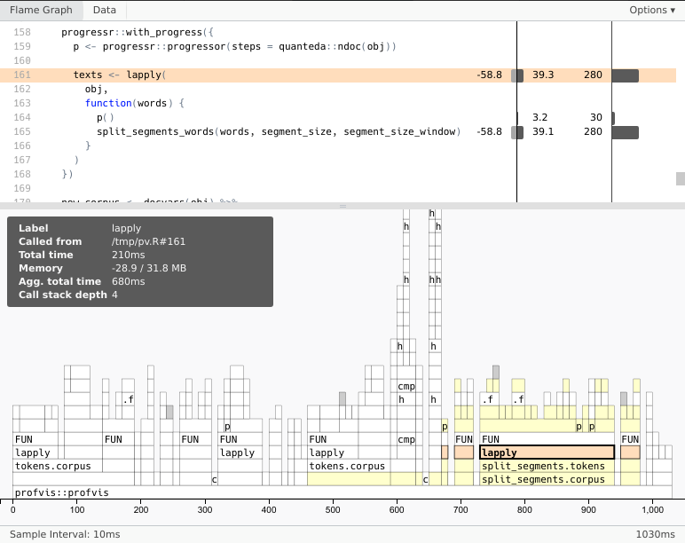

# Débuggage et performance {#debug-perf}

## Débugguer une fonction

Lorsqu'on commence à écrire des fonctions un peu complexes, avec des `if`, des `for`, et autres joyeusetés, arrive forcément un moment où ça ne fonctionne pas comme on le souhaiterait et où on ne comprend pas pourquoi. Bref, *il y a un bug*.

Trouver la cause d'un bug n'est pas toujours évident, mais il existe plusieurs méthodes et outils permettant de faciliter un peu les choses.

On commence par charger les extensions et les jeux de données dont on aura besoin par la suite.

```{r message=FALSE}
library(tidyverse)
library(questionr)
data(hdv2003)
data(starwars)
```

### print()

L'outil le plus simple, rudimentaire et parfois décrié mais qui reste efficace, est de rajouter un `print()` dans le code de notre fonction pour examiner le contenu d'un objet à un moment donné.

Prenons un exemple. La fonction suivante prend en argument un tableau de données et un nom de variable, et retourne la moyenne et l'écart-type de cette variable.

```{r}
indicateurs <- function(df, var) {
    valeurs <- df[, var]
    if (!is.numeric(valeurs)) return(NA)
    list(
        moyenne = mean(valeurs, na.rm = TRUE),
        sd = sd(valeurs, na.rm = TRUE)
    )
}
```

On teste notre fonction sur une variable du jeu de données `hdv2003`. Tout semble fonctionner.

```{r}
indicateurs(hdv2003, "age")
```

On teste à nouveau, cette fois sur une variable du jeu de données `starwars` de `dplyr`.

```{r}
indicateurs(starwars, "height")
```

Sapristi, on obtient `NA` en résultat, alors que notre variable `height` est bien numérique, on devrait donc obtenir un vecteur avec la moyenne et l'écart-type. Comment expliquer ce résultat ?

Comme on n'a pas d'explication immédiate juste en relisant le code de notre fonction, on va ajouter temporairement une instruction `print()` qui va afficher le contenu de `valeurs` juste après qu'elle soit calculée.

```{r}
indicateurs <- function(df, var) {
    valeurs <- df[, var]
    print(valeurs)
    if (!is.numeric(valeurs)) return(NA)
    list(
        moyenne = mean(valeurs, na.rm = TRUE),
        sd = sd(valeurs, na.rm = TRUE)
    )
}
```

On lance cette fonction modifiée sur `starwars` :

```{r}
indicateurs(starwars, "height")
```

Le `print()` nous indique que `valeurs` n'est pas un vecteur mais un tableau de données à une seule colonne. Or dans ce cas, le test `is.numeric`, qui est sensé s'appliquer à un vecteur atomique, renvoie `FALSE`.

```{r}
is.numeric(starwars[, "height"])
```

C'est donc la raison pour laquelle on obtient le résultat final `NA`.

Certes, mais alors pourquoi cela fonctionne-t-il dans notre exemple avec `hdv2003` ? 

```{r}
indicateurs(hdv2003, "age")
```

Ah ! Dans ce cas là `valeurs` est bien un vecteur, et on obtient donc le résultat attendu. Pourquoi cette différence ? On est en fait tombé sur une source d'erreur relativement fréquente qui est la différence de comportement, mentionnée section \@ref(df-sel), entre les *data frames* et les *tibbles* : lorsqu'on sélectionne une seule colonne avec l'opérateur `[,]`, un *data frame* retourne un vecteur tandis qu'un *tibble* retourne un tableau à une colonne. Or, ici, `hdv2003` est un *data frame*, et `starwars` un *tibble*.

Comment résoudre ce problème ? Il y a différentes manières, mais la plus simple est sans doute de remplacer `[,]` par `[[]]`, qui lui a le même comportement dans les deux cas. On peut donc modifier notre fonction (en n'oubliant pas d'enlever le `print()`) et vérifier que ça fonctionne désormais.

```{r}
indicateurs <- function(df, var) {
    valeurs <- df[[var]]
     if (!is.numeric(valeurs)) return(NA)
     list(
        moyenne = mean(valeurs, na.rm = TRUE),
        sd = sd(valeurs, na.rm = TRUE)
    )
}

indicateurs(hdv2003, "age")
indicateurs(starwars, "height")
```


```{block type='rmdimportant'}
Quand on ajoute des `print()` pour essayer d'identifier un problème, il faut bien penser à les supprimer une fois ce problème résolu, sinon on risque de se retrouver avec des messages "parasites" dans la console.
```


### Localiser une erreur

`print()` peut aussi être utile pour savoir à quel moment une erreur se produit, notamment lorsqu'on utilise une boucle.

Dans l'exemple suivant, on crée une fonction `min_freq_values()` qui prend en argument un tableau de données `df` et un effectif `n_min` et retourne une liste des modalités de variables qui apparaissent dans au moins `n_min` lignes de `df` (on utilise ici une boucle `for`, mais on aurait aussi pu utiliser `map()`).

```{r}
min_freq_values <- function(df, n_min) {
    res <- list()
    for (col in names(df)) {
        # On fait le tri à plat des valeurs de la colonne
        freq <- table(df[[col]])
        # On ne conserve que les modalités avec effectif >= n
        freq <- freq[freq >= n_min]
        # On ajoute la colonne au résultat que s'il y a au moins une modalité
        if (length(freq) > 0) res[[col]] <- freq
    }
    res
}
```

Si on applique `min_freq_values()` à `hdv2003` avec une valeur de `n` à 1500, on obtient toutes les modalités correspondant à au moins 1500 observations.

```{r}
min_freq_values(hdv2003, 1500)
```

Essayons maintenant d'appliquer `min_freq_values()` au jeu de données `starwars` de `dplyr`.

```{r error=TRUE}
min_freq_values(starwars, 50)
```

On obtient un message quelque peu sybillin : apparemment une erreur se produit au moment de faire le tri à plat des valeurs avec `table()`. Mais comme ce tri à plat s'effectue dans une boucle, on ne sait pas quelle variable de `starwars` est à l'origine du problème.

On va donc rajouter comme première instruction de la fonction du `for` un `print(col)`.

```{r error=TRUE}
min_freq_values <- function(df, n_min) {
    res <- list()
    for (col in names(df)) {
        print(col)
        # On fait le tri à plat des valeurs de la colonne
        freq <- table(df[[col]])
        # On ne conserve que les modalités avec effectif >= n
        freq <- freq[freq >= n_min]
        # On ajoute la colonne au résultat que s'il y a au moins une modalité
        if (length(freq) > 0) res[[col]] <- freq
    }
    res
}

min_freq_values(starwars, 50)
```

On voit que tout se passe bien pour les premières variables de notre tableau, et que l'erreur survient au moment de traiter la variable `films`. On regarde donc à quoi ressemble cette variable.

```{r}
head(starwars$films, 3)
```

*Damn*, cette variable n'est pas un vecteur atomique mais une liste ! Un tableau de données peut en effet contenir ce que l'on appelle des colonnes-listes. Comme ça n'est pas fréquent, on ne l'avait clairement pas prévu au moment de la création de la fonction.

On a désormais identifié le problème, on peut donc le corriger par exemple en ignorant les colonnes de type liste en utilisant `is.list()` et l'instruction `next`.

```{r}
min_freq_values <- function(df, n_min) {
    res <- list()
    for (col in names(df)) {
        # On passe à la colonne suivante si la colonne est une colonne-liste
        if (is.list(df[[col]])) next
        # On fait le tri à plat des valeurs de la colonne
        freq <- table(df[[col]])
        # On ne conserve que les modalités avec effectif >= n
        freq <- freq[freq >= n_min]
        # On ajoute la colonne au résultat que s'il y a au moins une modalité
        if (length(freq) > 0) res[[col]] <- freq
    }
    res
}

min_freq_values(starwars, 50)
```


### browser()

Il y a cependant des alternatives à `print()` plus efficaces pour identifier et résoudre des bugs. La plus utilisée est la fonction `browser()`. Celle-ci peut s'insérer à n'importe quel endroit du code, et lorsqu'elle est rencontrée par R celui-ci s'interrompt et affiche une invite de commande permettant notamment d'inspecter des objets.

On reprend l'exemple précédent en remplaçant le `print(col)` que nous avions inséré pour débugguer la fonction `min_freq_values` par un appel à `browser()`.


```{r eval=FALSE}
min_freq_values <- function(df, n_min) {
    res <- list()
    for (col in names(df)) {
        browser()
        # On fait le tri à plat des valeurs de la colonne
        freq <- table(df[[col]])
        # On ne conserve que les modalités avec effectif >= n
        freq <- freq[freq >= n_min]
        # On ajoute la colonne au résultat que s'il y a au moins une modalité
        if (length(freq) > 0) res[[col]] <- freq
    }
    res
}

min_freq_values(starwars, 50)
```

Lorsqu'on lance ce code, R s'interrompt et affiche l'invite de commande suivant :

```
Called from: min_freq_values(starwars, 50)

Browse[1]>
```

Cette invite de commande offre plusieurs possibilités. En particulier, on peut lui indiquer du code R qui sera exécuté dans le contexte au moment de l'interruption : si on indique un nom d'objet, on pourra donc afficher sa valeur. Ainsi, si on tape `col`, R nous affiche la valeur actuelle de `col`, donc au moment de la première itération de la boucle.

```
Browse[1]> col                                       
[1] "name"
```

On peut également fournir des commandes spécifiques : si on tape `n`, R va passer à l'instruction suivante puis s'interrompre à nouveau^[Si on a un objet `n` dont on souhaite afficher le contenu, on doit faire `print(n)`.].

```
Browse[1]> n                                           
debug à #6 : freq <- table(df[[col]])
```

Si on tape `c`, R va relancer l'exécution jusqu'à la fin, ou jusqu'à la prochaine rencontre d'un `browser()`. Dans notre cas, cela signifie qu'on va continuer jusqu'au `browser()` de la deuxième itération de la boucle.

```
Browse[2]> c                                           
Called from: min_freq_values(starwars, 50)

Browse[1]> col                                         
[1] "height"
```

Si on souhaite sortir de cette invite de commande et tout interrompre, il suffit de taper `Q`.

`browser()` est donc un peu plus complexe à utiliser que des `print()` ajoutés manuellement, mais c'est aussi un outil plus souple et plus puissant.

```{block type='rmdnote'}
Cette section n'offre qu'un petit aperçu des possibilités de débuggage. R propose d'autres fonctionnalités, et les environnements de développement comme RStudio ou Visual Studio Code proposent également leurs propres outils. 

Pour plus d'informations on pourra se reporter aux ressources en fin de chapitre.
```


## benchmarking : mesurer et comparer les temps d'exécution

Lorsqu'on commence à créer ses propres fonctions et de manière générale à écrire du code de plus en plus complexe ou à travailler sur des données de plus en plus volumineuses, on peut arriver sur des problèmes de performance : les temps d'exécution deviennent longs et on aimerait essayer de les optimiser.

Un outil utile consiste à faire du *benchmarking* : comparer plusieurs manières différentes de faire la même chose, et mesurer leurs différences de vitesse d'exécution.

L'intruction la plus simple pour cela est sans doute `system.time()`. Celle-ci prend en argument une expression R, et affiche en retour le temps d'exécution en secondes.

```{r}
system.time(runif(1000000))
```

L'expression peut comporter plusieurs instructions, dans ce cas on les entoure d'accolades.

```{r}
system.time({
    v <- runif(1000000)
    moy <- mean(v)
})
```

`system.time()` est cependant très limitée : on ne peut exécuter qu'une expression à la fois, on ne peut donc pas en comparer plusieurs directement, et surtout le temps d'exécution peut varier assez sensiblement selon l'utilisation du processeur de la machine au moment où on le lance.

Il existe donc en complément plusieurs extensions dédiées au *benchmarking*. On va utiliser ici l'extension [bench](https://bench.r-lib.org/), installable avec :

```{r eval=FALSE}
install.packages("bench")
```

`bench` propose une fonction principale, nommée `mark()`, qu'on peut donc appeler directement avec `bench::mark()`^[L'avantage d'utiliser `bench::mark()` est qu'on n'a pas besoin d'ajouter un `library(bench)` dans notre script.]. On passe à cette fonction plusieurs expressions, et `mark()` va effectuer les actions suivante :

- elle vérifie que les expressions retournent bien le même résultat (si on souhaite comparer des expressions qui renvoient des résultats différents, il faut ajouter l'argument `check = FALSE`)
- elle lance ces expressions plusieurs fois et mesure à chaque fois leur temps d'exécution
- elle affiche un résumé de ces temps d'exécution en indiquant notamment leur minimum et leur médiane

Exécuter chaque expression plusieurs fois permet de prendre en compte les fluctuation liées à l'activité du processeur de la machine. Par défaut, `bench::mark()` exécute chaque instruction au minimum une fois et au moins suffisamment de fois pour atteindre 0,5s d'exécution (ces valeurs peuvent être modifiées via les paramètres `min_iterations` et `min_time`).

Dans l'exemple suivant, on crée deux fonctions qui font la même chose : ajouter 10 à tous les éléments d'un vecteur passé en argument. Dans la première fonction `plus10_for` on utilise une boucle `for` qui ajoute 10 à tous les éléments l'un après l'autre (ce qu'il ne faut évidemment pas faire !), tandis que la deuxième fonction `plus10_vec` utilise la forme vectorisée `x + 10`.

```{r}
plus10_for <- function(x) {
    for (i in seq_along(x)) {
        x[i] <- x[i] + 10
    }
    x
}

plus10_vec <- function(x) {
    x + 10
}
```

On lance un benchmark avec `bench::mark()` et on stocke le résultat dans un objet.

```{r}
x <- 1:10000
bnch <- bench::mark(
    plus10_for(x),
    plus10_vec(x)
)
```

On affiche les résultats obtenus :

```{r}
bnch
```

La colonne la plus importante est sans doute la colonne `median`, qui affiche le temps médian d'exécution des deux expressions. Attention, l'unité de temps n'est pas forcément la même, ici l'exécution de `plus10_for` est affichée en millisecondes ("ms"), tandis que celle de `plus10_vec` l'est en microsecondes ("µs") donc avec une unité mille fois plus petite.

Si on préfère, on peut afficher les performances relatives des deux fonctions avec :

```{r}
summary(bnch, relative = TRUE)
```

Ces résultats nous permettent de voir que la version `vec` est nettement plus rapide que la version `for` ! Ce qui confirme le fait qu'il faut toujours prioriser l'utilisation de fonctions vectorisées lorsqu'elles existent.

On prend un second exemple : on souhaite mesurer si l'utilisation de `map` est plus rapide ou non qu'une boucle `for` pour une tache équivalente.

Pour cela on commence par créer artificiellement une liste de 200 tableaux de données en dupliquant 100 fois une liste composée des tableaux `rp2012` et `hdv2003`.

```{r}
dfs <- list(rp2012, hdv2003)
dfs <- rep(dfs, 100)
```

Puis on lance un benchmark sur une boucle `for` et un `map` qui retournent chacun les nombres de ligne des 200 tableaux. Cette-fois on ne crée pas de fonctions : on passe le code directement à `bench::mark()`, avec des noms permettant de les identifier plus facilement dans les résultats.

```{r}
bench::mark(
    boucle_for = {
        res <- list()
        for (df in dfs) {
            res <- c(res, nrow(df))
        }
        res
    },
    map = map(dfs, ~ nrow(.x) )
)
```

La lecture du résultat indique que le `map` est environ 4 fois plus rapide que la boucle `for`.


## Quelques conseils d'optimisation

### Privilégier les fonctions vectorisées

On l'a déjà dit, redit et reredit, une des forces de R est de proposer un grand nombre de fonctions vectorisées, c'est-à-dire prévues et optimisées pour s'appliquer à tous les éléments d'un vecteur. Quand une fonction vectorisée existe, il est donc toujours préférable de l'utiliser plutôt qu'une boucle ou un `map`.

```{r}
v <- rep(c("Pomme", "Poire", "Fraise"), 100)
bench::mark(
    boucle = {
        map_int(v, str_count, "m")
    },
    vec = str_count(v, "m")
)
```

### Mettre le minimum d'opérations dans les boucles

Si vous utilisez une boucle, toute opération qu'elle contient, comme elle va être répétée, peut devenir rapidement très coûteuse. Il ne faut donc y mettre que les opérations réellement nécessaires.

La fonction suivante prend en entrée un tableau de données `d` et une chaîne de caractères `chr`, et retourne un vecteur nommé indiquant le nombre de fois ou cette valeur apparaît dans chaque colonne du tableau. On a décidé de convertir en minuscules à la fois la valeur de `chr` et l'ensemble des colonnes du tableau pour que le comptage ne prenne pas en compte les différences de majuscules/minuscules.

```{r}
nb_chaine1 <- function(d, chr) {
    res <- numeric()
    for (var in names(d)) {
        # Conversion des colonnes de d et de chr en minuscules
        d <- d %>% modify(str_to_lower)
        chr <- str_to_lower(chr)
        # Comptage des occurrences de chr dans la colonne var
        res[[var]] <- sum(d[[var]] == chr, na.rm = TRUE)
    }
    res
}

d <- hdv2003[, c("hard.rock", "qualif", "clso", "bricol")]
nb_chaine1(d, "oui")
```

Ça fonctionne, mais si on regarde un peu plus attentivement le code de la fonction on peut vite se rendre compte d'un problème : les conversions en minuscules sont faites à l'intérieur de la boucle, et sont donc répétées pour chaque colonne de `d`. Or ceci n'est absolument pas nécessaire puisque cette conversion ne dépend pas des colonnes et qu'elle peut être faite une seule et unique fois en début de fonction.

On décide donc de sortir les conversion en minuscules de la boucle.

```{r}
nb_chaine2 <- function(d, chr) {
    res <- numeric()
    
    # Conversion des colonnes de d et de chr en minuscules
    d <- d %>% modify(str_to_lower)
    chr <- str_to_lower(chr)

    for (var in names(d)) {
        # Comptage des occurrences de chr dans la colonne var
        res[[var]] <- sum(d[[var]] == chr, na.rm = TRUE)
    }
    res
}

nb_chaine2(d, "oui")
```

Le résultat des deux fonctions est identique. On compare leur temps d'exécution à l'aide de `bench::mark()`.

```{r}
bench::mark(
    nb_chaine1(d, "oui"),
    nb_chaine2(d, "oui"),
)
```

Ce qui permet de constater que la deuxième version est quatre fois plus rapide (et elle sera d'autant plus rapide que le nombre de colonnes du tableau sera grand).


### Choisir un format de fichier adapté

Si on travaille sur des fichiers de données volumineux, les temps de chargement et de sauvegarde des données peuvent devenir importants.

Il existe différents formats de fichiers qui pourront être plus ou moins efficaces et pratiques selon l'utilisation qu'on en fait :

- le format CSV est pratique pour échanger des données d'un système à un autre, mais ces fichiers sont assez volumineux et les temps de lecture / écriture assez longs. À noter que si `read_csv()` de `readr` est plus rapide que `read.csv()` de R base, il existe des alternatives encore plus rapides comme `fread()` de `data.table` ou les fonctions de l'extension `vroom`.
- pour un usage interne à R, les formats `Rdata` (utilisé par `load()` et `save()`) et `RDS` (utilisé par `readRDS()` et `saveRDS()`) ont des temps de lecture plus rapides et conservent les informations sur les types de données. Avec ces formats on peut faire varier le niveau de compression des données et donc jouer sur le rapport entre espace disque utilisé et temps d'accès.
- pour des données vraiment volumineuses, les formats `parquet` (du package `arrow`) ou `fst` proposent des temps de lecture et d'écriture très rapides.

Il n'est malheureusement pas toujours simple de s'y retrouver d'autant que les formats et les performances peuvent évoluer assez rapidement. 

À titre indicatif, le billet (en anglais) [a shallow benchmark of R data frame export/import methods](https://data.nozav.org/post/2019-r-data-frame-benchmark/) propose un comparatif entre les performances de différents formats de fichiers. Attention cependant, il date de 2019 et les performances des fonctions testées ont pu évoluer depuis.


### Repérer les opérations coûteuses avec du *profiling*

Quand on commence à écrire du code un peu long, il n'est pas toujours évident de savoir quelles sont les opérations qui sont les plus coûteuses en termes de performance. Il peut alors être utile d'utiliser un outil de *profiling*, qui consiste justement à exécuter du code tout en mesurant les temps d'exécution de chaque instruction, ce qui permet ensuite de visualiser et repérer les opérations qui prennent le plus de temps et qui seraient donc les plus intéressantes à optimiser (si c'est possible).

L'extension `profvis` fournit un outil de *profiling* sous R pratique et utile. On passe des instructions ou un script entier à la fonction `profvis()`, et celle-ci fournit une visualisation interactive des différentes opérations, de leur temps d'exécution, de leur utilisation de la mémoire...



L'utilisation de `profvis()` dépasse le cadre de ce document, mais on pourra trouver des explications (en anglais) dans la partie [profiling](https://adv-r.hadley.nz/perf-measure.html#profiling)  d'Advanced R.


### Mettre en cache les résultats intermédiaires

Selon la taille des données et le type d'opérations réalisées, les temps de calculs même optimisés peuvent demeurer longs. Dans ce cas il peut être intéressant de "mettre en cache" des résultats intermédiaires dans des fichiers pour pouvoir les charger directement sans avoir à tout recalculer.

Par exemple, si on travaille sur un corpus de données textuelles, on peut enregistrer dans un fichier `RDS` ou `Rdata` le résultat de toutes les opérations de prétraitement du corpus pour n'avoir qu'à charger ces fichiers si on souhaite effectuer de nouvelles analyses.

L'idéal cependant est d'utiliser une extension comme `targets`, présentée section \@ref(targets), qui gère automatiquement les dépendances entre les étapes d'un projet et la mise en cache des résultats, et permet ainsi d'optimiser les temps de traitement.


### Utiliser d'autres extensions

Enfin, si ce document est basé sur les extensions du *tidyverse*, qui offrent une syntaxe cohérente et plus facile d'accès, il existe d'autres extensions notamment dans le domaine de la manipulation des données qui permettent des opérations plus rapides.

C'est notamment le cas de l'extension `data.table`, qui utilise une syntaxe moins accessible que celle de `dplyr`, mais propose des performances en général [assez nettement supérieures](https://h2oai.github.io/db-benchmark/).

On trouvera la documentation détaillée de `data.table` (en anglais) [sur le site de l'extension](https://rdatatable.gitlab.io/data.table/).


## Ressources

L'ouvrage *Advanced R* (en anglais) consacre un chapitre entier [au debuggage](https://adv-r.hadley.nz/debugging.html), un autre à [la mesure de la performance](https://adv-r.hadley.nz/perf-measure.html), et un dernier à différentes techniques d'[optimisation du code](https://adv-r.hadley.nz/perf-improve.html).

Le site de RStudio propose une page entière détaillant ses [fonctionnalités de debugging](https://support.rstudio.com/hc/en-us/articles/205612627-Debugging-with-RStudio) (en anglais). Pour les utilisateurs de Visual Studio Code, on pourra se référer à l'extension [VSCode-R-Debugger](https://github.com/ManuelHentschel/VSCode-R-Debugger).

